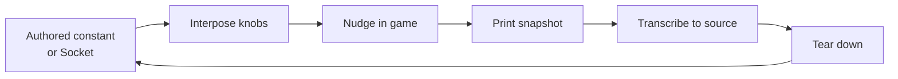

# Animation and Model Tuning

How to find a placement or magnitude that has no acceptance test but the screen — a socket that sits wrong after a
Blockbench export, a carry angle that reads as stiff — without paying a rebuild and a relaunch per guess. Concepts live
in [animation_system.md](animation_system.md); getting an exported clip into the system at all lives
in [animation_import_blockbench.md](animation_import_blockbench.md). This doc covers the developer overlay you stand up
to settle those numbers, and — the half that is easy to skip — taking it back out afterwards.

This document deliberately lists nothing that is currently tunable. At rest, nothing is. That is the design, and the
next section is why.

---

## Start here

| If you are... | Start with |
|---|---|
| Placing a socket that renders wrong | [DebugTuningSocketKnobs](../../src/main/java/dev/breezes/settlements/infrastructure/rendering/debug/tuning/DebugTuningSocketKnobs.java), [DebugTuningSocketRegistry](../../src/main/java/dev/breezes/settlements/infrastructure/rendering/debug/tuning/DebugTuningSocketRegistry.java) |
| Settling a magnitude inside an authored clip | [DebugTuningKnob](../../src/main/java/dev/breezes/settlements/infrastructure/rendering/debug/tuning/DebugTuningKnob.java), [DebugTuningGroup](../../src/main/java/dev/breezes/settlements/infrastructure/rendering/debug/tuning/DebugTuningGroup.java) |
| Changing the overlay itself | [DebugTuningBoard](../../src/main/java/dev/breezes/settlements/infrastructure/rendering/debug/tuning/DebugTuningBoard.java), [DebugTuningHudRenderer](../../src/main/java/dev/breezes/settlements/infrastructure/rendering/debug/tuning/DebugTuningHudRenderer.java) |
| Changing the keys or the dev gate | [DebugTuningClientGameEvents](../../src/main/java/dev/breezes/settlements/bootstrap/event/DebugTuningClientGameEvents.java), [DevTooling](../../src/main/java/dev/breezes/settlements/infrastructure/rendering/debug/DevTooling.java) |

---

## Scaffolding, not a feature

A tuning session is temporary wiring around a value that is already authored in source. The knobs exist to answer one
question — what should this number be — and the answer's home is the constant, not the board.



**The resting state is unwired.** Opening the overlay in a fresh dev build shows an empty panel, because nothing has
registered a group. That is correct rather than a missing step: the permanent kit is the board, its renderer, its keys,
and the two socket adapters, while the wiring from any one knob to any one value is stood up for a session and removed
with it.

The tear-down is load-bearing rather than tidiness. Live-value plumbing left behind after the number is settled is a
port with one implementation and no second producer — indirection that reads as a seam, is maintained as a seam, and
carries nothing. Everything downstream then pays for a variability that no longer exists: a value read per frame instead
of resolved once, a staleness check with nothing left to detect, a holder shared across entities for a rebuild that
never comes, and tests pinning the reactions of all of it.

---

## What the kit gives you

- [DebugTuningKnob](../../src/main/java/dev/breezes/settlements/infrastructure/rendering/debug/tuning/DebugTuningKnob.java) —
  one named scalar, with its own step and its own default.
- [DebugTuningGroup](../../src/main/java/dev/breezes/settlements/infrastructure/rendering/debug/tuning/DebugTuningGroup.java) —
  the knobs one consumer reads together, named after that consumer.
- [DebugTuningBoard](../../src/main/java/dev/breezes/settlements/infrastructure/rendering/debug/tuning/DebugTuningBoard.java) —
  every registered group, and the single cursor the keys act on.
- [DebugTuningHudRenderer](../../src/main/java/dev/breezes/settlements/infrastructure/rendering/debug/tuning/DebugTuningHudRenderer.java) —
  paints the board as a corner panel.
- [DebugTuningSocketKnobs](../../src/main/java/dev/breezes/settlements/infrastructure/rendering/debug/tuning/DebugTuningSocketKnobs.java)
  and [DebugTuningSocketRegistry](../../src/main/java/dev/breezes/settlements/infrastructure/rendering/debug/tuning/DebugTuningSocketRegistry.java) —
  the ready-made pair for the socket case, saving you from hand-rolling six knobs and an override.

Four properties are worth knowing before using any of it:

- **The board knows nothing about what a knob feeds.** A consumer registers its group and reads its own knobs back, so
  making a new kind of value tunable needs no change inside the tuning package.
- **A knob owns its step**, because values tuned together rarely share a unit — a small move in degrees and a small move
  in blocks differ by orders of magnitude, and one shared step would make half the board useless.
- **A knob owns its default, seeded from the authored value.** An untouched board therefore reproduces current behavior
  exactly, and every printed number is absolute: something to paste over the constant rather than add to it.
- **Rows a session actually moved are marked**, since those are the only ones worth transcribing.

The overlay paints its own legend naming the keys, so it is the authority on them and this document does not restate
them. Everything is keyboard-driven: one cursor walks every row, adjustment has a coarse and a fine step, reset acts on
the selected knob or the whole board, and a print writes the snapshot to chat.

---

## Standing up a session

Both paths require a dev build.
[DevTooling](../../src/main/java/dev/breezes/settlements/infrastructure/rendering/debug/DevTooling.java) gates the
keybinding and the GUI layer at **registration**, so in a production build neither exists — a key mapping that registers
in a player's build occupies a row in their controls screen and can collide with a binding they chose, and declining to
render afterwards undoes neither.

### A socket

1. Build a group with `DebugTuningSocketKnobs.forSocket`, handing it the authored
   [Socket](../../src/main/java/dev/breezes/settlements/domain/presentation/Socket.java) as its base.
2. Register that group on the board.
3. Wrap the `SocketRegistry` binding
   in [ClientAttachmentModule](../../src/main/java/dev/breezes/settlements/di/modules/client/ClientAttachmentModule.java)
   with `DebugTuningSocketRegistry.wrapping`, mapping the socket id to the knobs' `applyTo`.
4. For a mirrored pair, drive the opposite side from the **same** knobs through `applyMirroredTo`. One placement is one
   decision; two independent groups is how a rig ends up subtly asymmetric, and it doubles the rows on screen.
5. Verify in motion, not only at the rest pose.

### Anything else

There is no ready-made adapter for a clip magnitude or a display profile, but the moves are the same: build a group,
register it, and route the consumer's read through the knobs instead of the constant.

The interposed read carries one hard constraint. It sits on a path that already runs per sample, per entity, so it must
be cheap **and** it must report a value that compares equal to its previous one while nothing has changed. Without that
equality there is nothing to distinguish "the developer moved a knob" from "another frame happened", and whatever is
derived from the value is rebuilt continuously — for every entity on screen, with nothing about the result looking
wrong.

---

## Taking it back out

1. Print the snapshot and transcribe the moved rows into the authored source.
2. Remove the group registration, the knobs, and the override or port that carried live values in.
3. Remove the machinery that existed only to absorb mid-session change — a holder that shared a rebuilt value across
   entities, a staleness check, a per-sample read that can now resolve once.
4. Delete tests that only proved a live value reached its consumer. Keep, and where necessary rehome, tests that pin an
   invariant of the authored result; those outlive the session that motivated them.
5. Run the game once more with the scaffolding gone. This is the step that catches a transcription error, and the one
   most often skipped, because the value was verified minutes earlier — through a code path that no longer exists.

---

## Pitfalls

- **The board is in degrees; `Socket` stores radians.** Degrees are the unit placement is discussed and authored in, and
  a board printing radians would need converting by hand at exactly the moment numbers are being transcribed. The
  conversion lives inside the knobs, so a value read off the overlay is a value for a degree-taking factory.
- **Slot translation is in blocks, not the model units the rig is authored against.** A number that looks plausible in
  Blockbench is off by orders of magnitude here.
- **A registered group with no override moves nothing.** The rows respond, the printed value changes, and the world does
  not, because the consumer is still reading the authored constant. Confirm the interposition is actually in the path
  before concluding a value has no visible effect.
- **A knob is a departure, not an absolute.** A socket transform composes after the socket's own rotation and after
  whatever the animation contributes, frequently about the same axis. That chain is why these values are settled by eye
  rather than derived, and why a number that looks wrong in isolation can be correct.
- **Leaving the scaffolding in.** See [Scaffolding, not a feature](#scaffolding-not-a-feature).

---

## Deliberate constraints

- **The override is a decorator, never a mutable registry.** Authored values stay the single authority and stay
  immutable, the override is confined to the sockets actually being tuned, and removing the facility is one unwrapping
  at the binding rather than an edit inside domain code.
- **The adjustment keys are read raw rather than through key mappings.** They are live only while the overlay is
  showing, and binding them in the controls screen would cost a developer more to set up than the tool saves.
- **The snapshot prints to chat rather than only to the log.** Values are read at the moment they look right, and
  switching away to find a log file is where a tuning session loses the number it just found.

---

## Finding current implementations

There is no inventory of tuned surfaces to consult — at rest there are none. To find a session someone left standing:

```powershell
rg "DebugTuningGroup|DebugTuningBoard" src/main/java/dev/breezes/settlements --glob "!**/debug/tuning/**"
rg "DebugTuningSocketRegistry|DebugTuningSocketKnobs" src/main/java
rg "DevTooling.isEnabled" src/main/java
```

The first and third always match the permanent kit — the board's binding in the client graph, its key handler, and the
two dev gates at registration. A standing session is anything beyond those.
