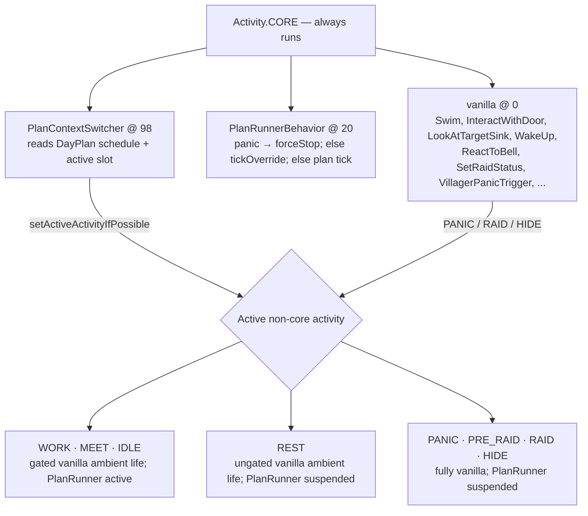

# Behavior Orchestration Framework

This document describes how Settlements villagers are orchestrated across activity contexts — how the plan-driven
foreground, the reactive override lane, the scripted social-cue lane, and the vanilla ambient background coexist within
the same server tick without conflicting over movement, interaction, or navigation targets.

For the plan-generation internals (behavior catalog, pool resolution, window packing), see
[`behavior_system.md`](behavior_system.md).

---

## Overview

Villager intelligence in Settlements runs as several concurrent lanes on the vanilla brain plus a few post-brain ticks
driven directly from `BaseVillager.customServerAiStep()`:

1. **Foreground (plan-driven)** — `PlanRunner` executes a personalized `DayPlan` of sequential
   `PlanSlot` entries. It owns what the villager is *doing* at any given moment.
2. **Reactive override** — a preemption slot that rides *inside* `PlanRunnerBehavior`. Pluggable
   `OverridePolicy` strategies can interrupt the running plan slot (independently of vanilla PANIC/RAID/HIDE) when a
   fresh, high-priority stimulus arrives — a trade/courtship invite to accept, or a demanded item spotted nearby.
3. **Background (activity-ambient)** — contextual vanilla behaviors registered under the active activity fill the
   villager's time when the foreground is not occupying a resource channel. They own what the villager *feels like*
   during that time (strolling near the job site during work hours, gathering at the bell during social hours, wandering
   idly otherwise).
4. **Ambient social presentation (SocialCue)** — ticked *after* the brain each server tick. Scripted gaze, gesture, and
   speech-bubble beats, arbitrated per body channel so a villager can present socially while working.
   See [Ambient Social Cue Lane](#ambient-social-cue-lane) below.

`PlanRunnerBehavior` lives in `Activity.CORE` at priority 20 and ticks every server tick regardless of which activity is
asserted. A companion CORE behavior, `PlanContextSwitcher` at priority 98, reads the current plan and its authored
schedule and calls `brain.setActiveActivityIfPossible()` to select the right ambient context. The active activity's
behaviors provide the background layer.

`BaseVillager.customServerAiStep()` runs these in order each server tick:

1. `super.customServerAiStep()` — vanilla sensors and the vanilla `Brain` tick, which is where both Settlements CORE
   behaviors run (expanded below).
2. `settlementsBrain.tick(1)` — the mod-native sensor pass (see
   [`behavior_system.md`](behavior_system.md#sensors-the-read-side)).
3. `tickSocialCue()` — `SocialCueArbiter`; see [Ambient Social Cue Lane](#ambient-social-cue-lane).
4. `tickPerception()` — `PerceptionPipeline`, throttled, and skipped entirely while the SIS kill-switch is off.
5. `tickReconciler()` — discharges crash-orphaned teardown obligations.
6. `tickNameSync()` — republishes the villager's name if it drifted.

**SocialCue must tick after the brain.** Cue admission compares a cue's channels against the channels the running
behavior holds, and that descriptor is written during the brain tick.

The perception pass is dormant: `WorldEventBus` has no producers, so nothing reaches a villager through it. The bus and
pipeline are kept whole because the append-and-cursor contract is the seam a redesigned emission path plugs back into;
their own Javadoc and TODOs own that state. A one-time cursor seed (`seedEventCursorOnFirstTick`) runs ahead of step 1
on the villager's first step, under the same kill-switch as step 4.

Inside the vanilla brain tick:



Ambient behavior membership per activity lives in `VanillaAmbientBehaviorPackages`.

When vanilla CORE behaviors assert PANIC, RAID, or HIDE they take precedence because they fire before
`PlanContextSwitcher` in the same tick (lower priority number). `PlanRunnerBehavior` detects it is outside the managed
activity set on its next tick and suspends the active plan slot. When the vanilla override clears and
`PlanContextSwitcher` re-asserts a managed activity, the plan resumes.

The **reactive override lane** is different: it is *not* a vanilla brain override and *not* a new activity. It runs
inside `PlanRunnerBehavior.tick()` before the activity gate, so it can preempt the plan under any managed activity.
See [Reactive Override Lane](#reactive-override-lane) below.

---

## Key Concepts

### PlanRunnerBehavior

**File:** `infrastructure/minecraft/behavior/planning/PlanRunnerBehavior.java`

A `Behavior<Villager>` registered in `Activity.CORE` at priority 20. It wraps the `PlanRunner`
application service and drives it on every server tick. It is only registered for **adult**
villagers (`if (!this.isBaby())` in `BaseVillager.registerBrainGoals()`); babies stay on the vanilla baby packages.

| Property | Behavior |
|----------|----------|
| `timedOut()` | Always `false` — the behavior never expires by timeout. |
| `canStillUse()` | Always `true` — the behavior never yields to vanilla's lifecycle management; stop/start decisions belong to `PlanRunner` itself. |
| `checkExtraStartConditions()` | Guards on: entity is `BaseVillager`, and is safe (`!VillagerPanicTrigger.isHurt` and `!VillagerPanicTrigger.hasHostile`). |
| `tick()` | See below. |
| `stop()` | Calls `planRunner.forceStop()` — discharges both the override slot and the active plan behavior. |

**`tick()` logic (evaluated in order each tick):**

1. **Panic guard.** Re-checks safety (hurt or hostile nearby). If unsafe → `planRunner.forceStop()`
   and return. `forceStop` discharges *both* the override slot and the active plan behavior.
2. **Override gate.** `planRunner.tickOverride(level, villager)` — evaluates and advances the reactive override slot. If
   it returns `true`, an override is active this tick and the plan tick is skipped entirely (return). This runs *before*
   the activity gate so reactive accepts fire ahead of normal plan execution, under any activity.
   See [Reactive Override Lane](#reactive-override-lane).
3. **Activity gate.** If the active non-core activity is absent *or* not in the managed set
   `{WORK, MEET, IDLE}` → `planRunner.suspendIfActive()`, then `planRunner.ensureValidPlan()`, and return. The
   `ensureValidPlan` call is load-bearing: REST can span the game-day rollover, so the runner prepares/repairs a valid
   plan before the activity flips back to a managed activity at wake time.
4. Otherwise → `planRunner.tick()`.

`PlanRunnerBehavior` is retrieved from an **unscoped** `Provider<PlanRunnerBehavior>` inside
`BaseVillager.registerBrainGoals()`. Unscoped is load-bearing: a vanilla `Behavior` holds per-entity status, so every
villager must get its own instance — a `@ServerScope` binding here would share one across the whole server.
`PlanContextSwitcher` is plain-constructed (`new PlanContextSwitcher()`) for the same reason and needs nothing from the
graph.

### PlanContextSwitcher

**File:** `infrastructure/minecraft/behavior/planning/PlanContextSwitcher.java`

A `Behavior<Villager>` registered in `Activity.CORE` at priority 98. It runs on a cooldown (`TICK_COOLDOWN`) and caches
the last derived activity to avoid redundant
`setActiveActivityIfPossible` calls on stable ticks. Each eligible tick it derives a target activity and calls
`brain.setActiveActivityIfPossible(target)`. It does **not** consult the override lane — that deliberately sits inside
`PlanRunnerBehavior` so it can fire regardless of which activity
`PlanContextSwitcher` last asserted.

**Phase derivation (evaluated in order):**

| Condition | Target activity |
|-----------|----------------|
| No `DayPlan` on the villager | `fallbackActivity()` — see below |
| Now is outside the plan's authored day (at or past `bedtimeTick`, or before `wakeTick`) | `Activity.REST` |
| Active slot whose `BehaviorCategory` is `WORK` | `Activity.WORK` |
| Active slot whose `BehaviorCategory` is `SOCIAL` | `Activity.MEET` |
| Active slot with any other category (`SELF_CARE`, `LEISURE`, `COMBAT`) | fall through |
| Now falls inside a `DayPlanActivityBlock` | that block's `DayPlanActivityContext`, mapped one-to-one onto the vanilla `Activity` of the same name |
| No block contains now | `Activity.IDLE` |

The "active slot" check reads `BehaviorPlanningMetadata` from `PlanRuntimeState.getCurrentDescriptor()`. The slot must
have status `ACTIVE`; a pending or completed slot does not claim the context.

All comparisons happen in **civil time** (`domain/time/CivilTime.java`) — tick 0 is midnight and the axis never wraps —
so an authored day is a plain forward interval and no comparison here needs modular arithmetic. The pre-`wakeTick` arm
of the REST check exists for exactly that reason: a freshly regenerated plan ticked in the sliver before its own wake
tick reaches REST directly instead of being folded past bedtime by a wraparound.

**`fallbackActivity()` — plan-absent path:**

When the villager has no plan (unloaded chunk, first spawn, plan generation lag),
`PlanContextSwitcher` falls back to a profession-default schedule rather than freezing the villager. It reads
`ScheduleProfile.defaultFor(professionKey)`, re-anchors that profile's Minecraft-space ticks onto civil time, and
derives REST / IDLE / WORK / MEET windows from them. A profession whose work interval is empty (currently Nitwit) gets
`Activity.IDLE` for its whole waking window rather than a synthetic work or meet context.

`PlanContextSwitcher` does not assert PANIC, RAID, or HIDE — those are owned by vanilla CORE behaviors
(`VillagerPanicTrigger`, `SetRaidStatus`, `ReactToBell`) which fire at priority 0. Because `setActiveActivityIfPossible`
is gated on activity preconditions, a vanilla override that is already active simply blocks `PlanContextSwitcher`'s
assertion on subsequent ticks until the override clears.

### DayPlanSchedule and DayPlanActivityBlock

`DayPlanSchedule` (`domain/ai/planning/DayPlanSchedule.java`) is the authored day's frame — a
`wakeTick`, a `bedtimeTick`, and an ordered list of `DayPlanActivityBlock` — and it is what
`PlanContextSwitcher` reads when a plan is present. Both boundaries are civil ticks, and the record rejects a schedule
whose bedtime is not strictly after its wake; a day that appears to wrap midnight is a construction error, not a case to
handle.

A `DayPlanActivityBlock` is a half-open `[startTick, endTick)` civil range plus its
`DayPlanActivityContext`. `DayPlan` validates on construction that the blocks do not overlap.

`DayPlanComposer` populates the blocks during plan generation, emitting only `IDLE`, `WORK`, and
`MEET`: REST is owned by the `bedtimeTick` boundary rather than by a block, so nothing has to keep a trailing REST block
and the bedtime consistent with each other.

### PLAN_BEHAVIOR_ACTIVE Memory

**Registry:** `domain/ai/memory/MemoryTypeRegistry.java`

Defined as a `MemoryType<Boolean>` backed by `MemoryModuleTypeRegistry.PLAN_BEHAVIOR_ACTIVE`
(the `DeferredRegister<MemoryModuleType<?>>` entry lives in
`bootstrap/registry/memory/MemoryModuleTypeRegistry.java`).

**Ownership: `PlanRunner` exclusively.** `PlanContextSwitcher` does not touch this memory — it owns activity selection
only. Only `PlanRunner` has visibility into whether an `IBehavior` is currently executing.

- **Set** by `PlanRunner` when a plan slot behavior transitions to `ACTIVE` (in `tryStartSlot`), and also when a
  reactive **override** slot is installed (in `tryStartOverride`). Both cases mean
  "the runner is occupying the body."
- **Cleared** by `PlanRunner` when the plan behavior stops (`COMPLETED`, `SKIPPED`, `INTERRUPTED`), when
  `suspendIfActive()` or `forceStop()` runs, and when an override is aborted. A normally completed override does not
  clear it in `onOverrideCompleted`; the following plan tick does, as it re-enters `tryStartSlot` for the re-queued
  slot.

Ambient behaviors wrapped by `AmbientBehaviors.gated(...)` require `PLAN_BEHAVIOR_ACTIVE:
VALUE_ABSENT` as a precondition. This means they only activate during genuine idle windows — between plan slots, during
exhaustion mode, or while a plan slot behavior is in a passive waiting state — and they never compete with plan
execution (or an active override) for walk targets, look targets, or interaction locks.

**Explicit design decision:** the flag is binary (occupied / not occupied) rather than per-channel. Per-channel gating —
where, for example, an ambient movement behavior could run alongside a plan behavior that claims only
`BehaviorChannel.COGNITION` — is the intended future upgrade path. The
`BehaviorChannel` declarations already exist on `BehaviorPlanningMetadata` and the
[SocialCue lane](#ambient-social-cue-lane) already arbitrates on them, but the foreground/ambient boundary is still
governed by the binary flag.

### AmbientBehaviors

**File:** `infrastructure/minecraft/behavior/ambient/AmbientBehaviors.java`

A utility class with a single static factory method that wraps any vanilla `BehaviorControl` with the
`PLAN_BEHAVIOR_ACTIVE: VALUE_ABSENT` precondition gate:

```java
// Wraps a vanilla BehaviorControl so it only activates when PlanRunner is not occupying the entity
public static <T extends LivingEntity> BehaviorControl<T> gated(@Nonnull BehaviorControl<? super T> behavior)
```

Ambient behaviors under `Activity.WORK`, `Activity.MEET`, and `Activity.IDLE` go through this wrapper, with a small
deliberate exception set. `Activity.REST` behaviors are registered directly without gating, because `PlanRunner` is
always suspended during REST and there is nothing to exclude.

Three kinds of entry are ungated under WORK / MEET / IDLE. `ShowTradesToPlayer` is ungated on purpose: player-initiated
trading must be able to preempt plan slot execution, and gating it would stop the trade GUI from opening while a
behavior runs. The look behaviors and `ValidateNearbyPoi`
are also bare, with no comment recording whether that is deliberate — treat them as unreviewed rather than as a
documented exemption before copying the pattern.

For the ambient behaviors registered under each activity, see `VanillaAmbientBehaviorPackages`
(`application/ai/brain/VanillaAmbientBehaviorPackages.java`).

### Managed Activity Set

The set `{Activity.WORK, Activity.MEET, Activity.IDLE}` defines where `PlanRunner` is active. These are stock vanilla
`Activity` values — no new activity registration is required for the core orchestration design.

Adults are still given a `Schedule` — `ScheduleRegistry.SETTLEMENTS_SCHEDULE`, a stub that asserts
`Activity.IDLE` at noon and nothing else — only because the vanilla brain requires a non-null one. It drives no
transition; `PlanContextSwitcher` does.

`Activity.REST` is deliberately excluded from the managed set. The plan covers waking hours only;
`PlanContextSwitcher` transitions to REST outside the authored day, and vanilla's `WakeUp` (already in CORE) returns the
villager at wake tick. Plan generation produces no sleep `PlanSlot` — sleep timing is a biological schedule concern, not
a task the planner decides.

---

## Reactive Override Lane

The override lane lets a fresh, high-priority stimulus interrupt the running plan slot — *without*
being a vanilla brain override and *without* registering a new activity. It rides inside
`PlanRunnerBehavior` (the priority-20 CORE behavior), so it can fire under any activity, and it is strictly bounded so a
wedged override never freezes the villager.

### Where it runs

`PlanRunnerBehavior.tick()` calls `planRunner.tickOverride(level, villager)` *before* the activity gate (step 2 of the
tick logic above). If it returns `true`, the plan tick is skipped. Vanilla panic still short-circuits everything before
the override gate is reached.

**File:** `application/ai/planning/PlanRunner.java` (override state machine),
`application/ai/planning/PlanRuntimeState.java` (the override slot).

### The override slot

`PlanRuntimeState` holds a dedicated override slot (`overrideBehavior`, `overrideBehaviorKey`,
`overrideElapsedTicks`) separate from the plan slot, plus `isOverrideActive()` / `installOverride()`
/ `clearOverride()`. Keeping it separate means an override never mutates plan-slot bookkeeping; the interrupted slot is
simply re-queued when the override ends.

### `tickOverride` state machine

- **Active override** → `tickActiveOverride`: increments elapsed ticks; if they exceed the override's run-duration
  ceiling, `abortStuckOverride` force-stops it, clears the slot and the plan-active lock, and re-queues the interrupted
  slot. Otherwise it ticks the override; on
  `STOPPED` it calls `onOverrideCompleted`. The ceiling is the override behavior's own
  `getMaxRunDuration()` from the catalog descriptor — the same per-behavior mechanism plan slots use — falling back to
  `MAX_OVERRIDE_DURATION_TICKS` only for a key with no descriptor, so an accept-style override is not clipped to a
  generic ceiling meant for something else.
- **No active override** → `tryStartOverride`:
    1. Bails unless the current plan behavior is interruptible (`canInterruptCurrentPlanBehavior` →
       `descriptor == null || descriptor.isInterruptible()`).
    2. Evaluates the injected `Set<OverridePolicy>` in **priority order** (`OverridePolicy.priority()`
       descending, class-name tie-break), taking the first `OverrideRequest`.
    3. Builds the requested behavior from the catalog, force-completes its cooldowns, and checks preconditions. If
       preconditions are not yet met, it returns `false` — the policy polls every tick, so nothing is consumed and the
       still-live trigger is re-evaluated next tick.
    4. Suspends the running plan behavior (`suspendIfActive` marks the slot `INTERRUPTED`), installs the override, sets
       `PLAN_BEHAVIOR_ACTIVE`, and starts it.

### Override policies (the non-vanilla preemption set)

Registered as a Dagger multibinding in `di/modules/server/OverridePolicyModule.java`
(`@Multibinds Set<OverridePolicy>`, all policies `@IntoSet`):

| Policy | Priority | Fires when | Installs |
|--------|----------|-----------|----------|
| `SocialAcceptOverridePolicy` | 100 | Another villager has sent a trade or courtship invite. Delegates to `OverrideTriggerDetector`, which polls `CourtshipSessionRegistry` / `TradeSessionRegistry` (courtship > trade). | `COURTSHIP_ACCEPT` / `TRADE_ACCEPT` |
| `CollectDemandedItemOverridePolicy` | 50 | `DemandedGroundItemSensor` has flagged a demanded item nearby (`MemoryTypeRegistry.DEMANDED_GROUND_ITEM_NEARBY`) **and** no plan/override behavior is currently active **and** the villager's active non-core activity is one of `WORK`/`MEET`/`IDLE`. | `BehaviorKey.COLLECT_DEMANDED_ITEM` |

Unlike `SocialAcceptOverridePolicy`, `CollectDemandedItemOverridePolicy` explicitly checks `PLAN_BEHAVIOR_ACTIVE`
itself rather than relying solely on `tryStartOverride`'s `canInterruptCurrentPlanBehavior` gate. That gate only blocks
on a non-interruptible plan behavior — `COLLECT_DEMANDED_ITEM` (like most behaviors) is `interruptible(true)`, so
without the explicit check this policy could preempt an in-progress WORK/MEET/IDLE behavior. The design intent is
opportunistic idle-time top-up only, never a work interruption, so the policy adds its own idle-gap + managed-activity
gate on top. The managed-activity check also matters because `tickOverride` runs before the activity gate and is
therefore evaluated during REST too, where `PLAN_BEHAVIOR_ACTIVE` is likewise absent — restricting to `WORK`/`MEET`/
`IDLE` is what keeps this from firing during sleep.

Both are `@ServerScope` and must be stateless/pure — `evaluate(level, villager)` returns
`Optional<OverrideRequest>` and is polled every tick.

On completion, `onOverrideCompleted` clears the override slot and re-queues the interrupted slot so the villager resumes
its day where the override pre-empted it.

### Where the stimuli come from

`SocialAcceptOverridePolicy` reads the trade and courtship session registries, which the matching initiate behavior
writes to directly when it sends its invite. `CollectDemandedItemOverridePolicy`
reads the demanded-item sensor memory. Neither stimulus is broadcast: a registry is the state of record for a
first-accept-wins offer, and a broadcast log cannot be one, because two readers of the same announcement both believe
they have the offer.

---

## Ambient Social Cue Lane

Scripted presentation — gaze, gesture, and speech-bubble beats that give a villager an ambient social presence. It runs
beside the plan lane rather than inside it: a cue holds no plan slot, never sets `PLAN_BEHAVIOR_ACTIVE`, and cannot
preempt anything.

**File:** `application/ai/socialcue/SocialCueArbiter.java` (`@ServerScope`)

Cues are registered as Dagger multibindings in `di/modules/server/SocialCueCatalogModule.java`; the arbiter iterates the
collected set and never learns how it was assembled. Each tick it dispatches the active cue's due script steps, or —
when idle and off the scan throttle — walks the catalog for the first admissible cue. The admission scan is throttled
because it is a poll that costs work whether or not anything happened; active-cue dispatch is never throttled, since a
gaze or gesture step that lands a tick late is visible.

### Channel-granular admission

A cue's `BehaviorChannel` set must be disjoint from the running behavior's required channels, with a null descriptor
meaning nothing is running and every channel is free. This is the distinction the plan lane's binary [
`PLAN_BEHAVIOR_ACTIVE`](#plan_behavior_active-memory) flag deliberately does not draw, and it is the whole point of the
lane: ambient social presentation runs *alongside* work that does not claim those channels.

### Cadence

Four independent terms shape when a villager acts, each solving a different problem:

- **Per-key cooldown** — the same cue does not fire back-to-back. Charisma scales it (sociable villagers act more
  often), the villager's current occasion scales it further, and per-cue jitter keeps identical-charisma villagers from
  re-arming in lockstep.
- **Lane refractory** — a floor between any two spontaneous bubbles, so a villager cannot chain unrelated cues. Cues
  marked `bypassLaneRefractory` opt out because they answer something external and would otherwise go unanswered.
- **Per-target cooldown** — a lingering player is not waved at every cycle.
- **Fire chance** — thins out cues that would otherwise be eligible on every qualifying scan.

A freshly loaded crowd is spread by a one-time random phase offset on each villager's first admission scan, so a
settlement does not act in unison on the tick it loads.
`SocialCueCadencePolicy` holds the arithmetic for all of this as pure functions.

The lane is suppressed entirely while the villager is socially unavailable, and an in-flight cue is cancelled rather
than left to finish — otherwise a villager falling asleep mid-cue freezes holding a stale gaze or gesture until the
cue's natural finish tick.

### Cues that own shared state

A cue that mutates state outside itself does so from `SocialCueCatalogEntry`'s `onAdmit` callback, never from the
trigger — the arbiter evaluates a trigger before its last bail-out checks, so a trigger that mutates leaks state on
every rejected candidate. A cue that opens state something else must later see closed unwinds it from `onComplete`.
Cancellation is the gap in that pairing: a cue cut short never reaches `onComplete`, so such a cue needs a reaper behind
it as well.

### Gossip

Gossip is **presentation only**. The two cues pair two nearby villagers, turn them to face each other, and play a bubble
each; **no information moves between them** — not a knowledge entry, not a reputation delta, not a hint. Whether gossip
should carry anything is an open design question, and the answer today is that it carries nothing.

`GossipSessionRegistry` is the state of record for the pairing handshake: the initiator's cue sends an invite from its
`onAdmit`, the receiver's cue consumes it from its own `onAdmit`, and the receiver's `onComplete` closes the session.
`GossipSessionReaperServerEvents` reclaims invites nobody accepted and sessions whose cue never completed (a chunk
unload, a death mid-cue). It is registered unconditionally, for the reason below.

### The SIS kill-switch

`SocialCueCatalogModule` splits the catalog into a `@BaseLane` set and a `@CognitionScoped` set and merges the second in
only when `InferenceGate.isEnabled()`. Every cue registered today is
`@BaseLane`; the cognition set is legally empty and its multibinding machinery is kept for a future cognition-dependent
cue.

So the whole scripted social layer fires with the inference service off — and anything that keeps those cues from
wedging has to be registered just as unconditionally. Gate the gossip session reaper behind the kill-switch and an
unaccepted invite is never reclaimed, leaving both villagers permanently marked as participating and locked out of
gossip.

### Tuning

Cadence knobs live on the annotations in `application/ai/socialcue/SocialCueConfig.java`
(`general.toml`), which is also where the operator-facing descriptions, defaults, and ranges belong. Gossip range and
cadence still sit in `domain/ai/eventlane/EventLaneConfig.java` (`inference.toml`)
against a TODO to move them, since they tune a lane that runs regardless of the kill-switch.

---

## Context-Aware Planning (foreground shaping)

The plan the foreground lane runs is **opportunity-shaped**: behaviors whose real-world preconditions cannot currently
be met are down-weighted at generation time so the plan spends the villager's day on work that can actually happen. This
is a plan- *generation* concern; the full generator internals live in [`behavior_system.md`](behavior_system.md). The
orchestration-relevant summary:

- **Declared requirements.** A behavior declares zero or more `OpportunityRequirement`s on its
  `BehaviorPlanningMetadata.opportunities`. `OpportunityRequirement`
  (`domain/ai/planning/OpportunityRequirement.java`) is a **sealed interface** with three record variants:
  `KnownSiteOpportunity` (a named spatial memory holds a live site),
  `InventoryItemOpportunity` (the villager holds one of the items), and `JobSiteBlockOpportunity`
  (the `JOB_SITE` memory points at a matching block). Each self-evaluates against an
  `OpportunityProbe` — a server-thread seam over the three world reads, so the logic is testable without Minecraft.
- **Forecast, don't gate.** `OpportunityForecaster`
  (`application/ai/planning/OpportunityForecaster.java`) computes the set of `BehaviorKey`s that *lack* opportunity (a
  behavior lacks it if *any* declared requirement is unmet; behaviors with no requirements are never down-weighted).
  `PlanGenerationContextFactory` runs it on the server thread **before** the async plan-generation handoff, because
  decaying-memory reads are not thread-safe — only the plain `Set<BehaviorKey>` crosses the thread boundary (as
  `PlanGenerationContext.behaviorsLackingOpportunity`).
- **Down-weight, not filter.** Lacking keys get `PlannerPolicy.LOW_OPPORTUNITY_MULTIPLIER` applied to their weight
  rather than being removed, so a temporarily starved behavior stays in the pool and can still surface if nothing better
  exists. The `WindowPacker` drops only behaviors whose effective weight collapses to ≤ 0, which is why the multiplier
  must stay above zero.

Two generators can produce a plan, and the orchestration-relevant part is how they are ordered.
`PlanRunner` always submits a heuristic plan through `IAsyncPlanGenerator`
(`HeuristicAsyncPlanGenerator`, which runs the sync generator off-thread), and — when the SIS kill-switch and the plan
inference mode both allow it — additionally enqueues an LLM overlay request through `PlanRequestService`. Both land as
`PlanArrival`s on the same per-villager queue and are reconciled by `PlanRunner.arbitrate`, which prefers the later
target day and, on a tie, refuses to let a heuristic arrival displace an already-staged LLM overlay.

The heuristic is therefore the **floor**, not a placeholder: it lands first and always, so a villager always has a plan
whether or not the overlay ever arrives. Adoption happens at the next slot boundary — `adoptPendingIfReady` never swaps
a plan mid-slot.

---

## Explicit Design Decisions

| Decision | Choice | Rationale |
|----------|--------|-----------|
| `PlanRunnerBehavior` location | `Activity.CORE` | Must survive activity transitions without stop/start; CORE always ticks regardless of active activity. Placing it in each activity would restart it on every transition, interrupting mid-slot execution. |
| Reactive override rides inside `PlanRunnerBehavior` | Not a new activity, not a vanilla brain override | Only `PlanRunner` knows whether a plan behavior is running and interruptible; the override must be able to fire under any managed activity and must hand the body over cleanly (suspend → install → resume). A brain-priority behavior could not coordinate that. |
| Override precedence is policy-level | `OverridePolicy.priority()` | Cross-policy ordering (SocialAccept 100 > CollectDemandedItem 50) is independent of brain priority; the plan runner evaluates the multibound set in one place. |
| Every override is bounded in time | Per-behavior ceiling, `MAX_OVERRIDE_DURATION_TICKS` as fallback | Overrides are reactive and short-lived; a wedged one (e.g. mirroring a session that never closes) must not freeze the villager. On trip, force-stop and re-queue the interrupted slot. |
| Opportunity requirements down-weight, not filter | `PlannerPolicy.LOW_OPPORTUNITY_MULTIPLIER` | Keeps starved behaviors in the pool so plans stay resilient; the packer prunes only zero-weight entries, so the multiplier must stay above zero. Forecast is computed on the server thread before the async handoff (decaying-memory reads aren't thread-safe). |
| Activity transitions | Dynamic (`PlanContextSwitcher`) | Per-villager schedules vary by profession and authored plan blocks. A static `Schedule` cannot represent this. |
| Vanilla activities reused | `Activity.WORK`, `MEET`, `IDLE`, `REST` | No new activity registration required. Vanilla brain priority already handles PANIC/RAID/HIDE override for free via existing CORE behaviors. |
| Plan covers waking hours only | No sleep `PlanSlot` | Sleep timing is biological (`DayPlanSchedule.bedtimeTick`), not a task. The heuristic planner generates task slots; it should not decide when a villager sleeps. |
| `PLAN_BEHAVIOR_ACTIVE` is binary | Yes/No flag | Simpler than a per-channel bitmask for the foreground/ambient boundary. `BehaviorChannel` metadata drives finer-grained arbitration in the SocialCue lane instead. |
| SocialCue arbitrates per channel | `BehaviorChannel` disjointness | A binary "a behavior is running" flag cannot express that a cue and a behavior want different parts of the body. Channel disjointness is what lets ambient presentation coexist with work. |
| Cue registry mutations live in `onAdmit` | Not in the trigger | The arbiter evaluates a trigger before its last bail-out checks, so a trigger that mutates leaks state on every rejected candidate. |
| Gossip carries no information | Presentation only | Presentation and information transfer are separable, and pairing villagers to mime an exchange is worth having on its own. Coupling them again would decide the harder question by accident. |
| `Activity.REST` excluded from managed set | PlanRunner suspends | Sleep is fully ambient; no plan slots exist for that window. Clean boundary between task scheduling and biological rhythm. |
| Ambient behaviors wrap vanilla | `AmbientBehaviors.gated(inner)` | Reuses vanilla behavior logic unchanged; only the precondition gate is added. |
| `ShowTradesToPlayer` is not gated | Registered bare in WORK, MEET, IDLE | Player-initiated trading must be able to preempt plan slot execution. Gating it would prevent the trade GUI from opening while a behavior is running. |
| `PlanContextSwitcher` re-derives on a cooldown | `PlanContextSwitcher.TICK_COOLDOWN` | Activity context only changes at schedule or plan-slot boundaries. Re-deriving every tick wastes CPU and produces spurious `setActiveActivityIfPossible` calls on stable ticks. |
| Gene offsets applied at generation time | In `DayPlanComposer` | `ScheduleProfile` is a plain per-profession record of defaults. Chronotype/gene offsets adjust wake/sleep/meal and work-end ticks; these adjustments belong to plan generation, not the profile data model. |
| Fallback when plan is absent | `PlanContextSwitcher.fallbackActivity()` | Unloaded or first-spawn villagers must still cycle through plausible ambient activities instead of freezing on `Activity.IDLE` permanently. |

---

## Extending the Framework

### Adding an ambient behavior to an existing activity

1. Wrap the vanilla `BehaviorControl` with `AmbientBehaviors.gated(...)` (unless it must preempt plan execution — see
   `ShowTradesToPlayer` above).
2. Register it in `VanillaAmbientBehaviorPackages` under the relevant activity's list at an appropriate priority.
3. Update this document.

### Adding a reactive override

1. Implement `OverridePolicy` (`@ServerScope`, stateless): `priority()` for cross-policy precedence and
   `evaluate(level, villager)` returning an `Optional<OverrideRequest>` naming the `BehaviorKey`
   to install. Keep it cheap — it is polled every tick — and short-circuit early (as
   `SocialAcceptOverridePolicy` does when no invite is pending).
2. Bind it `@Binds @IntoSet` in `OverridePolicyModule`.
3. Ensure the target behavior exists in the catalog and declares `isInterruptible()` appropriately on the behaviors it
   may interrupt.
4. If the trigger depends on a new stimulus, give it a source the policy can poll cheaply — a sensor memory or a session
   registry. There is no live stimulus broadcast to hook into:
   `WorldEventBus` has no producers.
5. Update this document.

### Adding a new managed activity

Example: a future festival or ceremony activity.

1. Register the activity in `ActivityRegistry` if it is Settlements-owned, or reuse a vanilla
   `Activity` value if appropriate. `ActivityRegistry` holds a live `DeferredRegister<Activity>`
   wired into bootstrap but no registrations — its commented-out block is a worked example to replace, not dead code to
   revive.
2. Register its ambient behaviors in `VanillaAmbientBehaviorPackages`, gated or ungated per the intent described above.
3. Add the activity to `PlanRunnerBehavior`'s managed set if plan slots should execute during it. Omitting it gives the
   suspend behavior for free.
4. Add a derivation case to `PlanContextSwitcher` if the activity is asserted on a time or plan-phase basis. If the
   activity is triggered reactively (like PANIC via `VillagerPanicTrigger`)
   no `PlanContextSwitcher` change is needed — the reactive trigger fires before it and
   `setActiveActivityIfPossible` is naturally blocked by the override.
5. Update this document.

### Adding a plan-driven (foreground) behavior

Plan-driven behaviors execute as `PlanSlot` entries and are not registered here. They belong to the behavior catalog and
pool system — see [`behavior_system.md`](behavior_system.md). Ambient background behaviors and plan slot behaviors are
entirely separate concerns — one fills idle time, the other is the scheduled task.

---

## Vanilla-Delegated Activities

The following activities are currently fully vanilla. Settlements registers no behaviors under them and makes no
modifications to their logic.

| Activity | What triggers it | Handler |
|----------|-----------------|---------|
| `Activity.PANIC` | `VillagerPanicTrigger` (CORE, priority 0) detects nearby threat | Vanilla |
| `Activity.PRE_RAID` | Vanilla pre-raid logic (CORE) | Vanilla |
| `Activity.RAID` | `SetRaidStatus` (CORE, priority 0) detects active raid | Vanilla |
| `Activity.HIDE` | `ReactToBell` (CORE, priority 0) hears bell with no active raid | Vanilla |
| `Activity.PLAY` | Baby villagers — set at birth on the vanilla baby schedule | Vanilla |

`PlanRunnerBehavior` and `PlanContextSwitcher` are not registered for baby villagers. Babies are set to
`Schedule.VILLAGER_BABY` and given IDLE, PLAY, MEET, and REST packages from
`VanillaBehaviorPackages` — Settlements' in-repo copy of vanilla's `VillagerGoalPackages` — each still carrying
vanilla's own `UpdateActivityFromSchedule`, which is what drives their transitions in place of `PlanContextSwitcher`.
The behavior catalog contains adult profession routines and is not appropriate for baby villagers.

For PANIC, RAID, and HIDE: when vanilla asserts one of these, `PlanContextSwitcher` no longer controls the active
activity. `PlanRunnerBehavior` detects this on its next tick (current activity not in managed set) and calls
`planRunner.suspendIfActive()`; if the villager is actually unsafe (hurt/hostile), the panic guard calls
`planRunner.forceStop()` first. When the vanilla override clears, `PlanContextSwitcher` re-asserts the appropriate
managed activity and the plan resumes from where it was interrupted.
