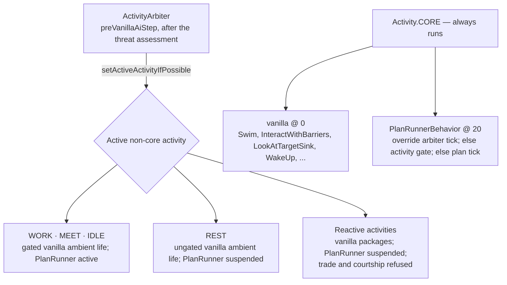

# Behavior Orchestration Framework

This document describes how Settlements villagers are orchestrated across activity contexts — how the plan-driven
foreground, the reactive override lane, the scripted social-cue lane, and the vanilla ambient background coexist within
the same server tick without conflicting over movement, interaction, or navigation targets.

For the plan-generation internals (behavior catalog, pool resolution, window packing), see
[`behavior_system.md`](behavior_system.md). For how a villager decides to fight or flee, and how a fight is carried
out, see [`threat_response.md`](threat_response.md).

---

## Overview

Villager intelligence in Settlements runs as several concurrent lanes on the vanilla brain plus a few pre- and
post-brain ticks driven directly from `BaseVillager.customServerAiStep()`:

1. **Foreground (plan-driven)** — `PlanRunner` executes a personalized `DayPlan` of sequential
   `PlanSlot` entries. It owns what the villager is *doing* at any given moment.
2. **Reactive override** — tiered execution arbitrated by `OverrideArbiter` and ticked *inside* `PlanRunnerBehavior`.
   Pluggable `OverridePolicy` strategies can interrupt the running plan slot when a fresh stimulus arrives — a threat
   the villager has chosen to fight, a trade/courtship invite to accept, or a demanded item spotted nearby — and a
   higher tier can in turn preempt a lower one that is already running.
3. **Background (activity-ambient)** — contextual vanilla behaviors registered under the active activity fill the
   villager's time when the foreground is not occupying a resource channel. They own what the villager *feels like*
   during that time (strolling near the job site during work hours, gathering at the bell during social hours, wandering
   idly otherwise).
4. **Ambient social presentation (SocialCue)** — ticked *after* the brain each server tick. Scripted gaze, gesture, and
   speech-bubble beats, arbitrated per body channel so a villager can present socially while working.
   See [Ambient Social Cue Lane](#ambient-social-cue-lane) below.

`PlanRunnerBehavior` lives in `Activity.CORE` at priority 20 and ticks every server tick regardless of which activity is
asserted. Which activity that is belongs to `ActivityArbiter`, which derives it from the villager's threat verdict, any
raid or bell, and its plan (see [Activity Arbitration](#activity-arbitration)). The active activity's behaviors provide
the background layer.

`BaseVillager.customServerAiStep()` runs these in order each server tick:

1. `settlementsBrain.preVanillaAiStep()` — decisions every vanilla behavior must read fresh this tick: the threat
   assessment, then the activity arbiter, which answers that assessment's verdict. Moved after the vanilla brain, a
   decision would reach those behaviors a tick late.
2. `super.customServerAiStep()` — vanilla sensors and the vanilla `Brain` tick, which is where `PlanRunnerBehavior`
   runs (expanded below).
3. `settlementsBrain.postVanillaAiStep()` — the mod-native sensor pass (see
   [`behavior_system.md`](behavior_system.md#sensors-the-read-side)).
4. `tickSocialCue()` — `SocialCueArbiter`; see [Ambient Social Cue Lane](#ambient-social-cue-lane).
5. `tickPerception()` — `PerceptionPipeline`, throttled, and skipped entirely while the SIS kill-switch is off.
6. `tickReconciler()` — discharges crash-orphaned teardown obligations.
7. `tickNameSync()` — republishes the villager's name if it drifted.

**SocialCue must tick after the brain.** Cue admission compares a cue's channels against the channels the running
behavior holds, and that descriptor is written during the brain tick.

The perception pass is dormant: `WorldEventBus` has no producers, so nothing reaches a villager through it. The bus and
pipeline are kept whole because the append-and-cursor contract is the seam a redesigned emission path plugs back into;
their own Javadoc and TODOs own that state. A one-time cursor seed (`seedEventCursorOnFirstTick`) runs between steps 1
and 2 on the villager's first step, under the same kill-switch as step 5.

The activity the arbiter selects in step 1 decides what the vanilla brain tick in step 2 does:


```mermaid
flowchart TD
    ARB["ActivityArbiter<br/>preVanillaAiStep, after the threat assessment"]
    ARB -->|" setActiveActivityIfPossible "| ACT
    CORE["Activity.CORE — always runs"]
    CORE --> VAN["vanilla @ 0<br/>Swim, InteractWithBarriers, LookAtTargetSink, WakeUp, ..."]
    CORE --> PRB["PlanRunnerBehavior @ 20<br/>override arbiter tick; else activity gate; else plan tick"]
    ACT{"Active non-core activity"}
    ACT --> MANAGED["WORK · MEET · IDLE<br/>gated vanilla ambient life; PlanRunner active"]
    ACT --> REST["REST<br/>ungated vanilla ambient life; PlanRunner suspended"]
    ACT --> REACTIVE["Reactive activities<br/>vanilla packages; PlanRunner suspended;<br/>trade and courtship refused"]
```

Ambient behavior membership per activity lives in `VanillaAmbientBehaviorPackages`; the reactive activities' packages
live in `VanillaBehaviorPackages`, except COMBAT's, which is empty because the combat runner owns a fighting villager
(see [`threat_response.md`](threat_response.md#combat)).

When the arbiter selects a reactive activity, `PlanRunnerBehavior` finds itself outside `DAY_PLAN_ACTIVITIES`,
suspends the running plan behavior and re-queues its slot. When the cause is gone, the arbiter's next evaluation derives
the daily context again and the villager retries that chore, unless its window closed in the meantime and the plan
skips it. A fight reaches the same result by another path: the combat runner is an override, and installing an
override re-queues the interrupted slot too.

The **reactive override lane** is different: it is *not* a vanilla brain override and *not* a new activity. It runs
inside `PlanRunnerBehavior.tick()` before the activity gate, so it can preempt the plan under any activity its policies
admit. See [Reactive Override Lane](#reactive-override-lane) below.

---

## Key Concepts

### PlanRunnerBehavior

**File:** `infrastructure/minecraft/behavior/planning/PlanRunnerBehavior.java`

A `Behavior<Villager>` registered in `Activity.CORE` at priority 20. It wraps the `PlanRunner` application service and
the `OverrideArbiter` and drives both on every server tick. It is only registered for **adult** villagers
(`if (!this.isBaby())` in `BaseVillager.registerBrainGoals()`); babies stay on the vanilla baby packages.

| Property | Behavior |
|----------|----------|
| `timedOut()` | Always `false` — the behavior never expires by timeout. |
| `canStillUse()` | Always `true` — the behavior never yields to vanilla's lifecycle management; stop/start decisions belong to `PlanRunner`/`OverrideArbiter` themselves. |
| `checkExtraStartConditions()` | Guards on: entity is `BaseVillager`. |
| `tick()` | See below. |
| `stop()` | Calls `planRunner.forceStop()` and `overrideArbiter.forceStop()` — discharges both lanes — then recomputes `PLAN_BEHAVIOR_ACTIVE`. |

**`tick()` logic (evaluated in order each tick; `PLAN_BEHAVIOR_ACTIVE` is recomputed before every `return` — see
[`PLAN_BEHAVIOR_ACTIVE` Memory](#plan_behavior_active-memory)):**

1. **Override gate.** `overrideArbiter.tick(level, villager)` — evaluates and advances the override lane. If it returns
   `true`, the lane occupied the villager this tick and the plan tick is skipped entirely (return). This runs *before*
   the activity gate so reactive accepts fire ahead of normal plan execution, under any activity their policies admit.
   See [Reactive Override Lane](#reactive-override-lane).
2. **Activity gate.** If the active non-core activity is absent *or* not in `DAY_PLAN_ACTIVITIES`
   `{WORK, MEET, IDLE}` → `planRunner.suspendIfActive()`, then `planRunner.ensureValidPlan()`, and return. The
   `ensureValidPlan` call is load-bearing: REST can span the game-day rollover, so the runner prepares/repairs a valid
   plan before the activity flips back to a day-plan activity at wake time.
3. Otherwise → `planRunner.tick()`.

There is no safety check of its own. Danger reaches the runner only as a reactive activity: the activity gate suspends
the day plan, and no non-emergency override policy admits a reactive activity, so a running override is stopped at its
next admission check. A separate hurt-or-hostile check would be a second opinion on danger that disagrees with the
threat assessment, for example about damage the assessment deliberately ignores.

`PlanRunnerBehavior` is retrieved from an **unscoped** `Provider<PlanRunnerBehavior>` inside
`BaseVillager.registerBrainGoals()`. Unscoped is load-bearing: a vanilla `Behavior` holds per-entity status, so every
villager must get its own instance — a `@ServerScope` binding here would share one across the whole server.
`PlanRunner` and `OverrideArbiter` are themselves `@ServerScope` singletons injected into that per-entity instance; per-
villager override state lives on `OverrideRuntimeState` (`villager.getOverrideRuntimeState()`), not on the arbiter.

### Activity Arbitration

**File:** `application/ai/brain/ActivityArbiter.java`

The single source of a villager's non-core activity, adults and babies alike. `VillagerBrain` constructs one per villager
(plain `new`, not Dagger: it holds that villager's evaluation state) and ticks it from `preVanillaAiStep()` right after
the threat assessment, so the activity answers the verdict made that tick.

It is **level-triggered**: each evaluation derives the desired activity from current state alone and asserts it. No
activity has an exit behavior, so a reactive activity ends at the first evaluation after its cause is gone. Edge-
triggered entry with per-activity exits was rejected because one missed exit strands a villager in that activity.

**Precedence (first match wins):**

1. A COMBAT verdict → `COMBAT`, ahead of every raid row, so a villager that fights is never sent to shelter by a live
   wave.
2. A PANIC verdict during a live raid wave → `RAID_HIDE`: a villager that will not fight shelters instead of fleeing
   among the raiders.
3. A PANIC verdict → `PANIC`.
4. A raid at the villager's position, read from `Raid` directly: won → `RAID_CELEBRATE`; a wave live → `RAID_HIDE`;
   before the first wave or between waves → `PRE_RAID`. A stopped or lost raid counts as no raid.
5. A bell heard recently, with no raid → `HIDE`.
6. Otherwise the daily context, below.

How the verdict itself is reached is in [`threat_response.md`](threat_response.md#the-assessment).

The raid outranks the bell because `HIDE` ends on its own timer, which must not end shelter partway through a wave.
The bell row is bounded by vanilla's own hiding timeout, because vanilla only ends hiding for a villager that found a
hiding place. The arbiter never changes the brain's default activity.

The reactive activities — those that answer danger, a raid or a bell — are whatever `ActivityArbiter.isReactive`
accepts, the authority that override admission reads. The Settlements-owned ones are registered in `ActivityRegistry`;
the rest are vanilla.

**Throttling.** An evaluation runs on a staggered cadence, on a verdict change, or when another writer has changed the
activity since the last evaluation; any other tick costs a few comparisons. The activity is set only when it differs
from the active one. A few vanilla behaviors that remain in the packages still update the activity from
the schedule (hiding ending, a celebration stopping); the arbiter sees the change and re-derives on the next tick, so
those cost at most a one-tick blip.

Switching activity does not stop running vanilla behaviors; they run until their own stop conditions. Any code that
switches a villager into an activity which must take over its movement has to clear the previous activity's targets
itself, as the arbiter does on entering PANIC or COMBAT.

**Daily context — babies** is their vanilla schedule's activity at the current day time, the same lookup the brain
makes when it updates from its schedule. Baby packages therefore carry no `UpdateActivityFromSchedule`.

**Daily context — adults (evaluated in order):**

| Condition | Target activity |
|-----------|----------------|
| No `DayPlan` on the villager | `fallbackActivity()` — see below |
| Now is outside the plan's authored day (at or past `bedtimeTick`, or before `wakeTick`) | `Activity.REST` |
| Active slot whose `BehaviorCategory` is `WORK` | `Activity.WORK` |
| Active slot whose `BehaviorCategory` is `SOCIAL` | `Activity.MEET` |
| Active slot with any other category (`SELF_CARE`, `LEISURE`, `COMBAT`) | fall through |
| Now falls inside a `DayPlanActivityBlock` | that block's `DayPlanActivityContext`, mapped one-to-one onto the vanilla `Activity` of the same name |
| No block contains now | `Activity.IDLE` |

The "active slot" check reads `BehaviorPlanningMetadata` from `PlanRuntimeState.getCurrentDescriptor()`. The slot must
have status `ACTIVE`; a pending or completed slot does not claim the context.

All comparisons happen in **civil time** (`domain/time/CivilTime.java`) — tick 0 is midnight and the axis never wraps —
so an authored day is a plain forward interval and no comparison here needs modular arithmetic. The pre-`wakeTick` arm
of the REST check exists for exactly that reason: a freshly regenerated plan ticked in the sliver before its own wake
tick reaches REST directly instead of being folded past bedtime by a wraparound.

**`fallbackActivity()` — plan-absent path:**

When the villager has no plan (unloaded chunk, first spawn, plan generation lag), the arbiter falls back to a
profession-default schedule rather than freezing the villager. It reads `ScheduleProfile.defaultFor(professionKey)`,
re-anchors that profile's Minecraft-space ticks onto civil time, and derives REST / IDLE / WORK / MEET windows from
them. A profession whose work interval is empty (currently Nitwit) gets `Activity.IDLE` for its whole waking window
rather than a synthetic work or meet context.

### DayPlanSchedule and DayPlanActivityBlock

`DayPlanSchedule` (`domain/ai/planning/DayPlanSchedule.java`) is the authored day's frame — a
`wakeTick`, a `bedtimeTick`, and an ordered list of `DayPlanActivityBlock` — and it is what
`ActivityArbiter` reads for an adult's daily context when a plan is present. Both boundaries are civil ticks, and the
record rejects a schedule whose bedtime is not strictly after its wake; a day that appears to wrap midnight is a
construction error, not a case to handle.

A `DayPlanActivityBlock` is a half-open `[startTick, endTick)` civil range plus its
`DayPlanActivityContext`. `DayPlan` validates on construction that the blocks do not overlap.

`DayPlanComposer` populates the blocks during plan generation, emitting only `IDLE`, `WORK`, and
`MEET`: REST is owned by the `bedtimeTick` boundary rather than by a block, so nothing has to keep a trailing REST block
and the bedtime consistent with each other.

### PLAN_BEHAVIOR_ACTIVE Memory

**Registry:** `domain/ai/memory/MemoryTypeRegistry.java`

Defined as a `MemoryType<Boolean>` backed by `MemoryModuleTypeRegistry.PLAN_BEHAVIOR_ACTIVE`
(the `DeferredRegister<MemoryModuleType<?>>` entry lives in
`bootstrap/registry/memory/MemoryModuleTypeRegistry.java`).

**Ownership: `PlanRunnerBehavior` alone, as a derived value.** It recomputes the memory after every branch of its
`tick()` and after `stop()` from `BaseVillager.hasActiveExecution()`: present while a day-plan behavior runs or an
override is installed, absent otherwise. `PlanRunner` and `OverrideArbiter` never write it.

Deriving it from current state, rather than setting and clearing it where work starts and ends, leaves no exit path — an
override finishing, a rigid slot retrying its preconditions, an abort — that can strand it set and shut ambient life off.

Ambient behaviors wrapped by `AmbientBehaviors.gated(...)` require `PLAN_BEHAVIOR_ACTIVE:
VALUE_ABSENT` as a precondition. This means they only activate during genuine idle windows — between plan slots, during
exhaustion mode, or while a plan slot behavior is in a passive waiting state — and they never compete with plan
execution (or an active override) for walk targets, look targets, or interaction locks.

**Explicit design decision:** the flag is binary (occupied / not occupied) rather than per-channel. Per-channel gating —
where, for example, an ambient movement behavior could run alongside a plan behavior that claims only
`BehaviorChannel.COGNITION` — is the intended future upgrade path. The
`BehaviorChannel` declarations already exist on `BehaviorPlanningMetadata` and the
[SocialCue lane](#ambient-social-cue-lane) already arbitrates on them, but the foreground/ambient boundary is still
governed by the binary flag.

### AmbientBehaviors

**File:** `infrastructure/minecraft/behavior/ambient/AmbientBehaviors.java`

A utility class with a single static factory method that wraps any vanilla `BehaviorControl` with the
`PLAN_BEHAVIOR_ACTIVE: VALUE_ABSENT` precondition gate:

```java
// Wraps a vanilla BehaviorControl so it only activates when PlanRunner is not occupying the entity
public static <T extends LivingEntity> BehaviorControl<T> gated(@Nonnull BehaviorControl<? super T> behavior)
```

Ambient behaviors under `Activity.WORK`, `Activity.MEET`, and `Activity.IDLE` go through this wrapper, with a small
deliberate exception set. `Activity.REST` behaviors are registered directly without gating, because `PlanRunner` is
always suspended during REST and there is nothing to exclude.

Three kinds of entry are ungated under WORK / MEET / IDLE. `ShowTradesToPlayer` is ungated on purpose: player-initiated
trading must be able to preempt plan slot execution, and gating it would stop the trade GUI from opening while a
behavior runs. The look behaviors and `ValidateNearbyPoi`
are also bare, with no comment recording whether that is deliberate — treat them as unreviewed rather than as a
documented exemption before copying the pattern.

For the ambient behaviors registered under each activity, see `VanillaAmbientBehaviorPackages`
(`application/ai/brain/VanillaAmbientBehaviorPackages.java`).

### Day-Plan Activity Set

`PlanRunnerBehavior.DAY_PLAN_ACTIVITIES` — `{Activity.WORK, Activity.MEET, Activity.IDLE}` — defines where `PlanRunner`
ticks the day plan. These are stock vanilla `Activity` values. This set governs day-plan ticking only; the override
lane below is not gated by it, and each policy declares the activities it admits.

Adults are still given a `Schedule` — `ScheduleRegistry.SETTLEMENTS_SCHEDULE`, a stub that asserts
`Activity.IDLE` at noon and nothing else — only because the vanilla brain requires a non-null one. It drives no
transition; `ActivityArbiter` does. A vanilla behavior that updates from the schedule lands on the stub until the
arbiter re-derives on the next tick.

`Activity.REST` is deliberately excluded from this set. The plan covers waking hours only;
`ActivityArbiter` transitions to REST outside the authored day, and vanilla's `WakeUp` (already in CORE) wakes the
villager whenever any other activity is selected. Plan generation produces no sleep `PlanSlot` — sleep timing is a
biological schedule concern, not a task the planner decides.

---

## Reactive Override Lane

The override lane lets a stimulus install execution in place of the day plan *without* being a vanilla brain override
and *without* registering a new activity. It rides inside `PlanRunnerBehavior` (the priority-20 CORE behavior), so it
can fire under any activity its policies admit, and every runner it installs bounds its own work in time so a wedged
one never freezes the villager.

### Where it runs

`PlanRunnerBehavior.tick()` calls `overrideArbiter.tick(level, villager)` *before* the activity gate (step 1 of the tick
logic above). If it returns `true`, the plan tick is skipped. Danger reaches the lane only through the activity: no
policy below `EMERGENCY` admits a reactive activity (`ActivityArbiter.isReactive`), so a running override is
stopped at its next admission check once the arbiter selects one. Combat, an `EMERGENCY` policy, is admitted only
during `COMBAT`.

**Files:** `application/ai/override/` holds `OverrideArbiter` (arbitration), `OverrideRunner` and its implementations
(installed execution), `OverrideRuntimeState` (per-villager lane state, held on `BaseVillager`) and `DayPlanHandoff` (the
day-plan seam the arbiter depends on, implemented by `PlanRunner`). The tier and ordering rules live in
`domain/ai/override/`.

### Tiers and precedence

Every `OverridePolicy` declares an `OverridePrecedence`: a tier, then an explicit order within that tier. The tiers are a
closed set, high to low; adding one is a design change.

| Tier | Meaning |
|------|---------|
| `EMERGENCY` | Execution that must win over everything, protected day-plan work included. |
| `REACTIVE` | Answering another party's request, such as an invite. |
| `OPPORTUNISTIC` | Idle-time work the villager can take or leave. |

A precedence must be unique across policies. `OverrideArbiter` rejects a collision at construction, so relative order
never falls to `Set` iteration order.

### Arbitration

Policy evaluation runs on a per-villager cadence (`OverrideRuntimeState.EVALUATION_INTERVAL`) with a random phase, so a
village does not evaluate on one tick. The installed runner still ticks every server tick, so running execution
never lags.

- **Nothing installed.** Policies are evaluated in precedence order. A non-interruptible day-plan descriptor excludes
  `REACTIVE` and `OPPORTUNISTIC`; `EMERGENCY` ignores that protection. The first policy that returns a request is the
  only candidate: if the catalog behavior it names fails validation, lower policies wait for the next evaluation. A
  validated request suspends the running day-plan behavior and re-queues its slot to `PENDING` *before* the runner
  starts, so a start failure still leaves the day resumable.
- **Something installed.** Only tiers strictly above the running one are evaluated; the same or a lower tier never
  displaces it. A firing higher tier is validated first, then the running runner is stopped completely, then the new one
  starts. The running override's own policy is re-asked `isAdmissibleDuring` on the same cadence, so an activity change
  alone, such as a villager falling asleep mid-pickup, ends it.
- **Completion.** Once `OverrideRunner.isComplete()`, whether finished or wedged past its ceiling, the arbiter stops the
  runner and re-queues the interrupted slot. A natural finish and a wedge take the same path.
- **`forceStop`** (removal, a brain refresh) stops the installed runner without requeuing anything.

A runner owns its execution — start, tick, teardown and its duration ceiling — and never arbitrates; every comparison
above belongs to `OverrideArbiter`. An `OverrideRequest` takes one of two forms. A catalog behavior is validated and
wrapped in `SimpleBehaviorOverrideRunner`, which runs that one `IBehavior` under the behavior's own run-duration
ceiling. A runner the policy prepared is installed as is; that is how execution that is not one catalog behavior, such
as a fight, enters the lane.

### Override policies

Registered as a Dagger multibinding in `di/modules/server/OverridePolicyModule.java`, the authority on membership. A
policy is `@ServerScope` and stateless: `evaluate(level, villager)` reads state and returns an
`Optional<OverrideRequest>`, and `isAdmissibleDuring(activity)` declares which activities admit it, both for starting and
for staying installed. A policy below `EMERGENCY` must refuse every reactive activity; that refusal, not a safety check,
is what keeps ordinary overrides from running through danger, a raid or a bell. A prepared runner must be unstarted
and report its policy's tier, because preemption compares the running runner's tier.

A policy must never read `PLAN_BEHAVIOR_ACTIVE` to decide whether to fire. The memory also reports installed overrides,
so it is this lane's output, not an input. A policy that must yield to running day-plan work, as demanded-item pickup
does, reads `PlanRuntimeState.isBehaviorActive()`.

### Where the stimuli come from

Stimuli are pollable state, never broadcasts. The invite-accept policies read the courtship and trade session registries,
which the matching initiate behavior writes when it sends its invite; demanded-item pickup reads a sensor memory; combat
reads the villager's threat verdict. A registry is the state of record for a first-accept-wins offer, and a broadcast
log cannot be one, because two readers of the same announcement both believe they have the offer.

TODO: add player-requested overrides through debug commands and dialogue so a player can direct a villager to perform a
specific behavior immediately, such as asking a farmer to harvest pumpkins.

### Combat

A fight is this lane's one `EMERGENCY` policy: `CombatOverridePolicy` hands a villager whose verdict is COMBAT a
prepared `CombatOverrideRunner`, which holds the villager across successive combat actions for as long as the verdict
lasts. The runner, its actions and the combat options are in [`threat_response.md`](threat_response.md#combat).

---

## Ambient Social Cue Lane

Scripted presentation — gaze, gesture, and speech-bubble beats that give a villager an ambient social presence. It runs
beside the plan lane rather than inside it: a cue holds no plan slot, never sets `PLAN_BEHAVIOR_ACTIVE`, and cannot
preempt anything.

**File:** `application/ai/socialcue/SocialCueArbiter.java` (`@ServerScope`)

Cues are registered as Dagger multibindings in `di/modules/server/SocialCueCatalogModule.java`; the arbiter iterates the
collected set and never learns how it was assembled. Each tick it dispatches the active cue's due script steps, or —
when idle and off the scan throttle — walks the catalog for the first admissible cue. The admission scan is throttled
because it is a poll that costs work whether or not anything happened; active-cue dispatch is never throttled, since a
gaze or gesture step that lands a tick late is visible.

### Channel-granular admission

A cue's `BehaviorChannel` set must be disjoint from the channels the villager's running work occupies
(`BaseVillager.occupiedChannels`): the day-plan behavior's required channels plus those of any installed override. With
nothing running, every channel is free. This is the distinction the plan lane's binary [
`PLAN_BEHAVIOR_ACTIVE`](#plan_behavior_active-memory) flag deliberately does not draw, and it is the whole point of the
lane: ambient social presentation runs *alongside* work that does not claim those channels.

### Cadence

Four independent terms shape when a villager acts, each solving a different problem:

- **Per-key cooldown** — the same cue does not fire back-to-back. Charisma scales it (sociable villagers act more
  often), the villager's current occasion scales it further, and per-cue jitter keeps identical-charisma villagers from
  re-arming in lockstep.
- **Lane refractory** — a floor between any two spontaneous bubbles, so a villager cannot chain unrelated cues. Cues
  marked `bypassLaneRefractory` opt out because they answer something external and would otherwise go unanswered.
- **Per-target cooldown** — a lingering player is not waved at every cycle.
- **Fire chance** — thins out cues that would otherwise be eligible on every qualifying scan.

A freshly loaded crowd is spread by a one-time random phase offset on each villager's first admission scan, so a
settlement does not act in unison on the tick it loads.
`SocialCueCadencePolicy` holds the arithmetic for all of this as pure functions.

The lane is suppressed entirely while the villager is socially unavailable, and an in-flight cue is cancelled rather
than left to finish — otherwise a villager falling asleep mid-cue freezes holding a stale gaze or gesture until the
cue's natural finish tick.

### Cues that own shared state

A cue that mutates state outside itself does so from `SocialCueCatalogEntry`'s `onAdmit` callback, never from the
trigger — the arbiter evaluates a trigger before its last bail-out checks, so a trigger that mutates leaks state on
every rejected candidate. A cue that opens state something else must later see closed unwinds it from `onComplete`.
Cancellation is the gap in that pairing: a cue cut short never reaches `onComplete`, so such a cue needs a reaper behind
it as well.

### Gossip

Gossip is **presentation only**. The two cues pair two nearby villagers, turn them to face each other, and play a bubble
each; **no information moves between them** — not a knowledge entry, not a reputation delta, not a hint. Whether gossip
should carry anything is an open design question, and the answer today is that it carries nothing.

`GossipSessionRegistry` is the state of record for the pairing handshake: the initiator's cue sends an invite from its
`onAdmit`, the receiver's cue consumes it from its own `onAdmit`, and the receiver's `onComplete` closes the session.
`GossipSessionReaperServerEvents` reclaims invites nobody accepted and sessions whose cue never completed (a chunk
unload, a death mid-cue). It is registered unconditionally, for the reason below.

### The SIS kill-switch

`SocialCueCatalogModule` splits the catalog into a `@BaseLane` set and a `@CognitionScoped` set and merges the second in
only when `InferenceGate.isEnabled()`. Every cue registered today is
`@BaseLane`; the cognition set is legally empty and its multibinding machinery is kept for a future cognition-dependent
cue.

So the whole scripted social layer fires with the inference service off — and anything that keeps those cues from
wedging has to be registered just as unconditionally. Gate the gossip session reaper behind the kill-switch and an
unaccepted invite is never reclaimed, leaving both villagers permanently marked as participating and locked out of
gossip.

### Tuning

Cadence knobs live on the annotations in `application/ai/socialcue/SocialCueConfig.java`
(`general.toml`), which is also where the operator-facing descriptions, defaults, and ranges belong. Gossip range and
cadence still sit in `domain/ai/eventlane/EventLaneConfig.java` (`inference.toml`)
against a TODO to move them, since they tune a lane that runs regardless of the kill-switch.

---

## Context-Aware Planning (foreground shaping)

The plan the foreground lane runs is **opportunity-shaped**: behaviors whose real-world preconditions cannot currently
be met are down-weighted at generation time so the plan spends the villager's day on work that can actually happen. This
is a plan- *generation* concern; the full generator internals live in [`behavior_system.md`](behavior_system.md). The
orchestration-relevant summary:

- **Declared requirements.** A behavior declares zero or more `OpportunityRequirement`s on its
  `BehaviorPlanningMetadata.opportunities`. `OpportunityRequirement`
  (`domain/ai/planning/OpportunityRequirement.java`) is a **sealed interface** with three record variants:
  `KnownSiteOpportunity` (a named spatial memory holds a live site),
  `InventoryItemOpportunity` (the villager holds one of the items), and `JobSiteBlockOpportunity`
  (the `JOB_SITE` memory points at a matching block). Each self-evaluates against an
  `OpportunityProbe` — a server-thread seam over the three world reads, so the logic is testable without Minecraft.
- **Forecast, don't gate.** `OpportunityForecaster`
  (`application/ai/planning/OpportunityForecaster.java`) computes the set of `BehaviorKey`s that *lack* opportunity (a
  behavior lacks it if *any* declared requirement is unmet; behaviors with no requirements are never down-weighted).
  `PlanGenerationContextFactory` runs it on the server thread **before** the async plan-generation handoff, because
  decaying-memory reads are not thread-safe — only the plain `Set<BehaviorKey>` crosses the thread boundary (as
  `PlanGenerationContext.behaviorsLackingOpportunity`).
- **Down-weight, not filter.** Lacking keys get `PlannerPolicy.LOW_OPPORTUNITY_MULTIPLIER` applied to their weight
  rather than being removed, so a temporarily starved behavior stays in the pool and can still surface if nothing better
  exists. The `WindowPacker` drops only behaviors whose effective weight collapses to ≤ 0, which is why the multiplier
  must stay above zero.

Two generators can produce a plan, and the orchestration-relevant part is how they are ordered.
`PlanRunner` always submits a heuristic plan through `IAsyncPlanGenerator`
(`HeuristicAsyncPlanGenerator`, which runs the sync generator off-thread), and — when the SIS kill-switch and the plan
inference mode both allow it — additionally enqueues an LLM overlay request through `PlanRequestService`. Both land as
`PlanArrival`s on the same per-villager queue and are reconciled by `PlanRunner.arbitrate`, which prefers the later
target day and, on a tie, refuses to let a heuristic arrival displace an already-staged LLM overlay.

The heuristic is therefore the **floor**, not a placeholder: it lands first and always, so a villager always has a plan
whether or not the overlay ever arrives. Adoption happens at the next slot boundary — `adoptPendingIfReady` never swaps
a plan mid-slot.

---

## Explicit Design Decisions

| Decision | Choice | Rationale |
|----------|--------|-----------|
| `PlanRunnerBehavior` location | `Activity.CORE` | Must survive activity transitions without stop/start; CORE always ticks regardless of active activity. Placing it in each activity would restart it on every transition, interrupting mid-slot execution. |
| Reactive override rides inside `PlanRunnerBehavior` | Not a new activity, not a vanilla brain override | `OverrideArbiter` needs to know whether a plan behavior is running and interruptible, and must hand the body over cleanly (suspend → install → resume) under any day-plan activity. A brain-priority behavior could not coordinate that. |
| Arbitration is a separate component from execution | `OverrideArbiter` vs. `OverrideRunner` | Tier/order/admission/preemption decisions and one runner's own bookkeeping (elapsed ticks, its ceiling, exception containment) change for different reasons; combined, every new kind of execution would have to edit arbitration. |
| Override precedence is tier-then-order | `OverridePrecedence` (`OverrideTier` + explicit order) | A flat priority number cannot express "only strictly higher tiers may preempt a running one" without also encoding every pairwise comparison by hand. Duplicate precedence is rejected at construction rather than left to `Set` iteration order. |
| Every override runner is bounded in time | Per-behavior ceiling, a fixed fallback for a key with no descriptor; per action for combat | Overrides are reactive and short-lived; a wedged one (e.g. mirroring a session that never closes) must not freeze the villager. On trip, the runner reports complete and the arbiter stops it and re-queues the interrupted slot — identically to a natural finish. A fight's length is the verdict's to decide, so the combat runner bounds each action instead ([`threat_response.md`](threat_response.md#combat)). |
| Policy evaluation is throttled and staggered | `OverrideRuntimeState.EVALUATION_INTERVAL`, random per-villager phase | Evaluating every policy every tick for every villager is pure overhead on the peaceful path; ticking whatever is already installed still happens every tick so a running override never feels laggy. |
| Opportunity requirements down-weight, not filter | `PlannerPolicy.LOW_OPPORTUNITY_MULTIPLIER` | Keeps starved behaviors in the pool so plans stay resilient; the packer prunes only zero-weight entries, so the multiplier must stay above zero. Forecast is computed on the server thread before the async handoff (decaying-memory reads aren't thread-safe). |
| Activity selection | One level-triggered `ActivityArbiter` | Per-villager schedules vary by profession and authored plan blocks, which a static `Schedule` cannot represent. Deriving every activity, reactive ones included, from current state in one place leaves no exit behavior to miss and one list of which activities are reactive. |
| Danger is gated by activity | No hurt-or-hostile check in the plan or override lanes | The threat verdict picks the activity and the activity gates both lanes, so one judgment of danger decides everything. A second check would disagree with the assessment, for example about damage it deliberately ignores. |
| Raid phases are separate activities | `RAID_HIDE` and `RAID_CELEBRATE` in place of vanilla `RAID` | Vanilla's `RAID` bundles shelter and celebration; one activity per phase lets the activity name what the villager is doing. |
| Plan covers waking hours only | No sleep `PlanSlot` | Sleep timing is biological (`DayPlanSchedule.bedtimeTick`), not a task. The heuristic planner generates task slots; it should not decide when a villager sleeps. |
| `PLAN_BEHAVIOR_ACTIVE` is binary and derived | Yes/No flag, recomputed rather than set/cleared | Simpler than a per-channel bitmask for the foreground/ambient boundary. `BehaviorChannel` metadata drives finer-grained arbitration in the SocialCue lane instead. Deriving it from current state after every tick branch leaves no exit path that can strand it set. |
| SocialCue arbitrates per channel | `BehaviorChannel` disjointness | A binary "a behavior is running" flag cannot express that a cue and a behavior want different parts of the body. Channel disjointness is what lets ambient presentation coexist with work. |
| Cue registry mutations live in `onAdmit` | Not in the trigger | The arbiter evaluates a trigger before its last bail-out checks, so a trigger that mutates leaks state on every rejected candidate. |
| Gossip carries no information | Presentation only | Presentation and information transfer are separable, and pairing villagers to mime an exchange is worth having on its own. Coupling them again would decide the harder question by accident. |
| `Activity.REST` excluded from `DAY_PLAN_ACTIVITIES` | PlanRunner suspends | Sleep is fully ambient; no plan slots exist for that window. Clean boundary between task scheduling and biological rhythm. |
| Ambient behaviors wrap vanilla | `AmbientBehaviors.gated(inner)` | Reuses vanilla behavior logic unchanged; only the precondition gate is added. |
| `ShowTradesToPlayer` is not gated | Registered bare in WORK, MEET, IDLE | Player-initiated trading must be able to preempt plan slot execution. Gating it would prevent the trade GUI from opening while a behavior is running. |
| `ActivityArbiter` evaluates on a cadence and on change | Staggered cadence, plus a verdict change or another writer's change | Daily context only changes at schedule or plan-slot boundaries, so re-deriving every tick for every villager is pure overhead; the change triggers mean a new verdict or a foreign write is still answered on the next tick. |
| Gene offsets applied at generation time | In `DayPlanComposer` | `ScheduleProfile` is a plain per-profession record of defaults. Chronotype/gene offsets adjust wake/sleep/meal and work-end ticks; these adjustments belong to plan generation, not the profile data model. |
| Fallback when plan is absent | A profession-default schedule in `ActivityArbiter` | Unloaded or first-spawn villagers must still cycle through plausible ambient activities instead of freezing on `Activity.IDLE` permanently. |

---

## Extending the Framework

### Adding an ambient behavior to an existing activity

1. Wrap the vanilla `BehaviorControl` with `AmbientBehaviors.gated(...)` (unless it must preempt plan execution — see
   `ShowTradesToPlayer` above).
2. Register it in `VanillaAmbientBehaviorPackages` under the relevant activity's list at an appropriate priority.
3. Update this document.

### Adding a reactive override

1. Implement `OverridePolicy` (`@ServerScope`, stateless): `precedence()` returning a unique
   `OverridePrecedence` (pick the right `OverrideTier` and an order that does not collide with a sibling in the same
   tier — the arbiter rejects a collision at construction), `isAdmissibleDuring(activity)` declaring which activities
   admit it, and `evaluate(level, villager)` returning an `Optional<OverrideRequest>`: the catalog `BehaviorKey` to
   install, or an unstarted runner it prepared. Keep `evaluate` cheap — it is polled on the arbiter's evaluation
   cadence, not every tick — and short-circuit early (as `CourtshipAcceptOverridePolicy` does when no invite is
   pending).
2. Bind it `@Binds @IntoSet` in `OverridePolicyModule`.
3. For a catalog request, ensure the target behavior exists in the catalog. Either way, check that the behaviors it may
   interrupt declare `isInterruptible()` appropriately (only checked for `REACTIVE`/`OPPORTUNISTIC` tiers —
   `EMERGENCY` ignores it).
4. If the trigger depends on a new stimulus, give it a source the policy can poll cheaply — a sensor memory or a session
   registry. There is no live stimulus broadcast to hook into:
   `WorldEventBus` has no producers.
5. Update this document.

### Adding a combat option

See [`threat_response.md`](threat_response.md#adding-a-combat-option).

### Adding a new day-plan activity

Example: a future festival or ceremony activity.

1. Register the activity in `ActivityRegistry` if it is Settlements-owned, or reuse a vanilla
   `Activity` value if appropriate. A Settlements activity is created eagerly there, as `RAID_CELEBRATE` is, so it can
   be read as a constant.
2. Register its behaviors in `BaseVillager.registerBrainGoals()`; ambient ones go in `VanillaAmbientBehaviorPackages`,
   gated or ungated per the intent described above. An activity the brain does not know is never selected: the brain
   falls back to its default activity instead.
3. Add the activity to `PlanRunnerBehavior.DAY_PLAN_ACTIVITIES` if plan slots should execute during it. Omitting it
   gives the suspend behavior for free.
4. Give `ActivityArbiter` a case for it: a daily-context case if it follows the time or plan phase, or a precedence row
   if it answers a condition. A reactive activity must also be one `ActivityArbiter.isReactive` accepts, so ordinary
   overrides refuse it.
5. Update this document.

### Adding a plan-driven (foreground) behavior

Plan-driven behaviors execute as `PlanSlot` entries and are not registered here. They belong to the behavior catalog and
pool system — see [`behavior_system.md`](behavior_system.md). Ambient background behaviors and plan slot behaviors are
entirely separate concerns — one fills idle time, the other is the scheduled task.

---

## Reactive and Baby Activities

The reactive activities run vanilla behavior packages from `VanillaBehaviorPackages` — Settlements' in-repo copy of
vanilla's `VillagerGoalPackages` — with vanilla's own entry and exit behaviors removed, since `ActivityArbiter` both
enters and leaves them. `RAID_HIDE` holds only the search for shelter; the celebration behaviors live in
`RAID_CELEBRATE`, which needs no raid-won gate because the arbiter selects it only for a won raid. `COMBAT` runs no
vanilla behavior at all; the combat runner in the override lane does the fighting. What feeds `PANIC`'s flee is in
[`threat_response.md`](threat_response.md#panic).

`PlanRunnerBehavior` is not registered for baby villagers. Babies are set to `Schedule.VILLAGER_BABY` and given IDLE,
PLAY, MEET, and REST packages from `VanillaBehaviorPackages`; `ActivityArbiter` serves them like adults and derives
their daily context from that schedule. The behavior catalog contains adult profession routines and is not appropriate
for baby villagers.
