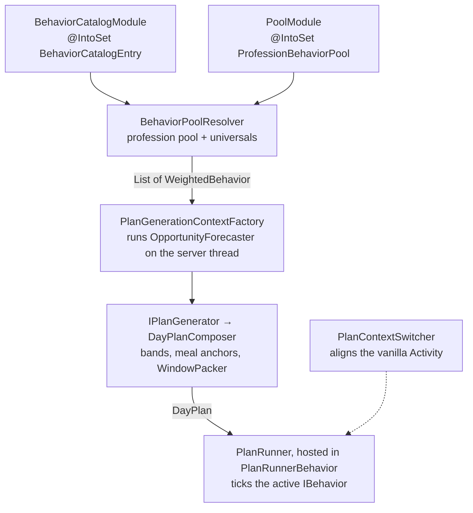

# Behavior System

This document covers how villager behaviors are registered, resolved into a day plan, and executed against the Minecraft
entity tick. For the Dagger fundamentals that underpin this system, see [Dagger Guide](dagger_guide.md); for the
step-by-step "add a behavior" recipe, see [Common Tasks](common_tasks.md#add-a-new-behavior).

---

## Overview

Behaviors are the core gameplay feature of Settlements. Each behavior (fishing, harvesting pumpkins, trading, etc.) is a
stateful state machine (`VillagerStateMachineBehavior`) that runs for the villager that owns it. Settlements does
**not**
register its behaviors as vanilla brain `Behavior`/`Activity` entries and does **not** let vanilla `GateBehavior` pick
them by weight. Instead it builds a **day plan** per villager and runs the plan with a **custom executor** that ticks
the active behavior directly. The vanilla `Brain` is still ticked — but only to host that executor and to run vanilla
reflexes (panic, raid) and gated ambient life.

The pipeline has four stages:

1. **Registration** — `BehaviorCatalogModule` describes every behavior (`BehaviorCatalogEntry`); `PoolModule` maps each
   profession to the `BehaviorKey`s it may perform (`ProfessionBehaviorPool`).
2. **Resolution** — `BehaviorPoolResolver` joins a villager's profession pool (plus universal behaviors) against the
   catalog into a `List<WeightedBehavior>` (availability + planning metadata).
3. **Planning** — an `IPlanGenerator` packs the available behaviors into an ordered `DayPlan` of time-windowed
   `PlanSlot`s, using each behavior's category, intensity, cooldown, duration, and opportunity.
4. **Execution** — `PlanRunner`, hosted inside the always-on `PlanRunnerBehavior` (vanilla CORE activity), walks the
   plan each server tick and calls `IBehavior.tick(...)` on the active behavior.



Sensors complete the read/write loop around memories: sensors write memory, behaviors and the planner read it. There are
**two live sensor frameworks** (see [Sensors](#sensors-the-read-side) below and
[Villager Memory](common_tasks.md#villager-memory-vanilla-backed-vs-decaying)).

---

## Stage 1 — Registration

Registration is split across two modules because "what a behavior *is*" and "which professions may *do* it" are separate
concerns.

### The catalog — `BehaviorCatalogModule`

**File:** `di/modules/server/BehaviorCatalogModule.java`

Every behavior has exactly one `@Provides @IntoSet static BehaviorCatalogEntry` method here. The entry *describes* the
behavior; it does **not** bind it to a profession.

**`BehaviorCatalogEntry`** (`di/catalog/BehaviorCatalogEntry.java`) is a record of:

- `BehaviorPlanningMetadata descriptor` — the planner-facing metadata: `BehaviorKey key`, `BehaviorCategory category`
  (`WORK | SOCIAL | SELF_CARE | LEISURE | COMBAT`), `WorkIntensity intensity` (`HEAVY | LIGHT | NONE`), the required
  `BehaviorChannel`s, `cooldown` (`CooldownRange`), `estimatedDuration`, `interruptible`, and zero or more
  `OpportunityRequirement`s.
- `BehaviorDisplayMetadata displayInfo` — display name key + icon item, for the day-plan UI.
- `Supplier<IBehavior<BaseVillager>> factory` — creates a fresh behavior instance per run.

```
@Provides
@IntoSet
static BehaviorCatalogEntry harvestPumpkin(HarvestPumpkinConfig config, BehaviorSupport support) {
    return BehaviorCatalogEntry.builder()
            .descriptor(BehaviorPlanningMetadata.builder()
                    .key(BehaviorKey.HARVEST_PUMPKIN)
                    .category(BehaviorCategory.WORK)
                    .intensity(WorkIntensity.HEAVY)
                    .requiredChannel(BehaviorChannel.MOVEMENT)
                    .cooldown(CooldownRange.ofSeconds(config.behaviorCooldownMin(), config.behaviorCooldownMax()))
                    .opportunity(new OpportunityRequirement.KnownSiteOpportunity(
                            Set.of(MemoryTypeRegistry.RIPE_PUMPKIN_SITES)))
                    .build())
            .displayInfo(BehaviorDisplayMetadata.builder()...build())
            .factory(() -> new HarvestPumpkinBehavior(config, support))
            .build();
}
```

The set is indexed by `BehaviorCatalogImpl` (implements `IBehaviorCatalog`), which exposes `getDescriptor(key)`,
`createBehavior(key)` (invokes the entry's `factory` → fresh instance), and `exists(key)`.

### The pools — `PoolModule`

**File:** `di/modules/server/PoolModule.java`

Each profession's available behaviors are a `@Provides @IntoSet static ProfessionBehaviorPool` method — a pure
availability mapping from a `VillagerProfessionKey` (a record with static constants, not an enum) to a list of
`PoolEntry`s. A `PoolEntry` is a `BehaviorKey` plus an optional relative weight (default 1; larger weights bias the
planner toward that behavior in packed windows).

```
static ProfessionBehaviorPool farmerPool() {
    return ProfessionBehaviorPool.builder()
            .profession(VillagerProfessionKey.FARMER)
            .entry(PoolEntry.of(BehaviorKey.HARVEST_PUMPKIN))
            .entry(PoolEntry.of(BehaviorKey.HARVEST_MELON))
            // ...
            .build();
}
```

Universal behaviors are **not** listed per profession — see [Resolution](#stage-2--resolution).

### `BehaviorKey`

**File:** `domain/ai/catalog/BehaviorKey.java`

The stable identity used everywhere else (catalog descriptor, pool entries, plan slots, day-plan UI). A new behavior
needs a new `BehaviorKey` constant.

> **The wiring seam:** the catalog entry and its config are Dagger-validated at compile time, but the pool mapping and
> `BehaviorKey` are not checked against the catalog. A behavior with a catalog entry that no pool references is dead —
> it will never be planned. See the [checklist in Common Tasks](common_tasks.md#add-a-new-behavior).

---

## Stage 2 — Resolution

**File:** `application/ai/catalog/BehaviorPoolResolver.java` (`@ServerScope`)

Injected with the `IBehaviorCatalog` and the `Set<ProfessionBehaviorPool>` from `PoolModule`. Its one method:

```
List<WeightedBehavior> resolve(VillagerProfessionKey profession)
```

It merges the profession's pool with the **universal** behaviors every profession can do —
`BehaviorPoolResolver.UNIVERSAL_ENTRIES`, the authority on that set — via `putIfAbsent`, so a profession's own weight
for a key wins over the universal default. Each merged `BehaviorKey` is joined against `catalog.getDescriptor(key)` and
paired with its pool weight into a `WeightedBehavior(descriptor, weight)`. A behavior every profession should have
belongs in `UNIVERSAL_ENTRIES`, not copied into each pool.

`COLLECT_DEMANDED_ITEM` is deliberately in neither — it is catalog-present but pool-absent, installed reactively by
`CollectDemandedItemOverridePolicy` (see
[`behavior_orchestration.md`](behavior_orchestration.md#reactive-override-lane)) rather than scheduled as a plan slot.
`TRADE_ACCEPT` and `COURTSHIP_ACCEPT` follow the same pattern: an override installs them, so nothing plans them.

The result is the "availability + metadata" list handed to the planner. There is no day-type filtering here — that is
applied later as planner multipliers.

---

## Stage 3 — Planning

**Entry point:** `domain/ai/planning/IPlanGenerator.java` — `DayPlan generate(PlanGenerationContext, PlanIntent)`.

`HeuristicPlanGenerator` (`application/ai/planning/`) implements it, but is a thin adapter: the composition lives in
**`DayPlanComposer`**, which runs three stages — a deterministic *frame* (wake, bedtime, and work bounds, no RNG), then
*anchors* (meals and any pins the intent carries), then *gap-fill*, packing each band's free sub-intervals. Its
collaborators are where each kind of decision lives: `PlanBand` and `PlannerPolicy` for band shape and weighting,
`MealAnchorRule` / `DefaultMealAnchorTable` for meal placement, `WindowPacker` for the packing itself, and a
`SlotSelectionStrategy` for which candidate wins a slot. `MinimalPlanFactory` produces the degenerate fallback plan.

`PlanIntent` is what separates the two generators: the heuristic path passes `PlanIntent.empty()`, which selects the
pure-heuristic fill policy, and the LLM overlay path passes a populated intent through the same composer. Both produce
a `DayPlan` the same way, so the overlay cannot skip a rule the heuristic obeys.

The composer reads the descriptor metadata that Stage 2 handed it:

- **`WorkIntensity` + `BehaviorCategory`** drive `RestDayPolicy` multipliers and afternoon ordering (e.g. a
  charisma-gated social preference).
- **`estimatedDuration`** sets each slot's length and the packer's window budget.
- **`cooldown`** sets per-key spacing/cadence in the window packer — this is where behavior cadence is enforced (**not**
  at runtime; see the execution note below).
- **`OpportunityRequirement`** applies `PlannerPolicy.LOW_OPPORTUNITY_MULTIPLIER` to any key the
  `OpportunityForecaster` reports as lacking a live opportunity, rather than hard-excluding it.

### Plan data structures (`domain/ai/planning/`)

**`DayPlan`** is an ordered `List<PlanSlot>` plus the day's identity and cursor. Its identity is `calendarDay` — that is
what the runner's calendar-mismatch guard compares against, and what makes a plan stale rather than merely finished.
`getWakeAtAbsoluteTick()` is derived from it and the schedule, not stored. `getCurrentSlot()` / `advanceSlot()` /
`isExhausted()` are the cursor.

**`PlanSlot`** carries a `startTick` in **civil time** (0 = midnight, valid 0–23999 — see `domain/time/CivilTime.java`),
a `BehaviorKey`, and a mutable `PlanSlotStatus` moving `PENDING → ACTIVE → COMPLETED | SKIPPED | INTERRUPTED`. Two
flags matter to the runner: a **flexible** slot is skipped when its preconditions fail while a rigid one arms a retry,
and a **pinned** slot — one placed at a fixed time by an LLM commitment rather than by gap-fill or a default meal — is
eligible to be carried into the successor plan when a hard reset regenerates the day.

### Opportunity forecasting

**File:** `application/ai/planning/OpportunityForecaster.java` (`@ServerScope`)

`forecastLackingOpportunity(BaseVillager, List<WeightedBehavior>)` evaluates each descriptor's `OpportunityRequirement`s
(AND-combined) against a live probe (inventory, job-site block, decaying sensed sites via `SensedSiteReader`). It **must
run on the server thread** (the decaying-memory read lazily expires entries), so `PlanGenerationContextFactory` runs it
while building the context and passes only the plain `Set<BehaviorKey>` into planning.

### Async path, the LLM overlay, and storage

`HeuristicAsyncPlanGenerator` (implements `IAsyncPlanGenerator`) wraps the sync generator in
`CompletableFuture.supplyAsync(..., @PlanGenerationExecutor)` so a plan can be pre-computed off-thread before a
villager's wake tick. Alongside it, `PlanRequestService` owns the LLM plan overlay's backend round-trip; it is enqueued
from the same place the heuristic successor is submitted, and is inert unless the SIS kill-switch is on and the plan
inference mode selects it.

Both land as `PlanArrival`s on one per-villager queue, tagged with a `PlanAuthor`, and `PlanRunner.arbitrate` reconciles
them: later target day wins, and on a tie a heuristic arrival never displaces an already-staged LLM overlay. The
heuristic is the **floor** — it lands first and always, so the villager has a plan whether or not the overlay arrives.
For how adoption is sequenced, see [`behavior_orchestration.md`](behavior_orchestration.md#context-aware-planning-foreground-shaping).

The plan lives in memory on the villager entity (`BaseVillager.getDayPlan()`/`setDayPlan()`) and is deliberately **not
persisted**: an unload discards it, and the next plan tick regenerates it through `PlanRunner`'s ordinary missing-plan
path. Transient cursor state lives in `PlanRuntimeState` (`villager.getPlanRuntimeState()`).

---

## Stage 4 — Execution

Settlements behaviors are ticked by a **custom executor**, not by vanilla `GateBehavior` — the vanilla brain never
picks a Settlements behavior by weight.

### Host — `PlanRunnerBehavior`

**File:** `infrastructure/minecraft/behavior/planning/PlanRunnerBehavior.java`

A vanilla `Behavior<Villager>` registered into the brain's **CORE** activity at priority 20, so it ticks every server
tick regardless of the active non-core activity. It never self-terminates (`timedOut()` → `false`, `canStillUse()` →
`true`) so it can suspend/resume the inner behavior across PANIC/RAID. Its `tick(...)`:

1. If unsafe (hurt / hostile nearby) → `planRunner.forceStop(...)`, return.
2. `if (planRunner.tickOverride(...)) return;` — reactive overrides fire **before** the plan gate.
3. Gate on the active non-core activity: if it is not in `MANAGED_ACTIVITIES = {WORK, MEET, IDLE}` →
   `planRunner.suspendIfActive(...)` + `ensureValidPlan(...)`, return.
4. Otherwise `planRunner.tick(...)`.

### The executor loop — `PlanRunner`

**File:** `application/ai/planning/PlanRunner.java` (`@ServerScope`)

`tick(level, villager)` advances the plan clock, adopts any pre-generated plan whose wake tick has arrived, runs a
cascade of invalidation guards, then dispatches on the current slot's status. The guards do not all recover the same
way, and the difference matters: an async overrun, a backward time jump, or a missing plan **hard-resets** (force-stop
plus regenerate), while an overdue plan or a calendar-day mismatch instead completes the expired plan and submits an
async successor — the day is over, not corrupt. An exhausted plan is neither: the tick simply returns and lets
generation own progress.

- **`PENDING` → `tryStartSlot`** — checks the slot window, `catalog.createBehavior(key)` for a fresh instance,
  force-completes the instance's cooldowns (cadence was already enforced at plan-gen time), runs
  `behavior.tickPreconditions(...)`; on success `behavior.start(...)`, records it on `PlanRuntimeState`, sets the
  `PLAN_BEHAVIOR_ACTIVE` memory, and marks the slot `ACTIVE`. A failed flexible slot is `SKIPPED`; a rigid slot arms a
  retry.
- **`ACTIVE` → `tickActiveSlot`** — **calls `behavior.tick(delta, level, villager)`** — the actual per-tick drive into
  the `VillagerStateMachineBehavior`. A run-duration ceiling (`descriptor.getMaxRunDuration()`, else
  `PlanRunner.DEFAULT_MAX_BEHAVIOR_RUN_TICKS`) aborts a stuck behavior, as does an exception thrown out of `tick`. When
  `behavior.getStatus() == STOPPED`, the slot is marked `COMPLETED`, the memory cleared, and `plan.advanceSlot()` moves
  on. Nothing is emitted here: the run's deeds stay on the behavior instance as its `BehaviorDeedLedger`, which has no
  reader today.
- **`COMPLETED | SKIPPED | INTERRUPTED`** → clear `PLAN_BEHAVIOR_ACTIVE`, `plan.advanceSlot()`.

### Overrides and interruptibility

`tickOverride(...)` runs a set of `OverridePolicy` (sorted by priority) before the plan tick — reactive behaviors like
accepting a trade/courtship invite that can pre-empt the plan. An override may only interrupt the current behavior if
its descriptor is `interruptible` (`canInterruptCurrentPlanBehavior`); this is where the `interruptible` metadata is
enforced. On completion the interrupted slot is re-queued `PENDING`.

### The `PLAN_BEHAVIOR_ACTIVE` latch

Whenever a plan slot or override is active, `PlanRunner` sets the vanilla-backed `PLAN_BEHAVIOR_ACTIVE` memory. Its
consumer is `AmbientBehaviors.gated(...)`, which wraps every vanilla ambient behavior in a `GateBehavior` requiring
`PLAN_BEHAVIOR_ACTIVE` to be **absent**. So the memory is the mutual-exclusion latch: while a Settlements behavior runs,
vanilla ambient life is suppressed.

> **Never leave a nav step uncapped.** Because a running behavior holds `PLAN_BEHAVIOR_ACTIVE`, a behavior that stalls
> (e.g. an unreachable navigation target) freezes not just the villager but the rest of its day plan until the
> run-duration ceiling or a PANIC frees it. Cap `StayCloseStep`/`NavigateToTargetStep` with a timeout + fail-over
> transition.

### Activity alignment — `PlanContextSwitcher`

**File:** `infrastructure/minecraft/behavior/planning/PlanContextSwitcher.java`

Also a vanilla CORE `Behavior<Villager>` (priority 98). On a cooldown it derives the target vanilla `Activity` from
the active slot's `BehaviorCategory` (`WORK → WORK`, `SOCIAL → MEET`) or the `DayPlanSchedule`, and calls
`brain.setActiveActivityIfPossible(...)`. This keeps the vanilla activity aligned so the `PlanRunnerBehavior` gate opens
and the correct ambient package is active. The full derivation order lives in
[`behavior_orchestration.md`](behavior_orchestration.md#plancontextswitcher).

### The behavior contract

Behaviors implement `IBehavior<BaseVillager>` (`domain/ai/behavior/contracts/IBehavior.java`): preconditions,
continue-conditions, precondition/behavior cooldown `ITickable`s, `getStatus()`, `tickPreconditions`, `start`, `tick`,
`stop`, `requestStop`. Concrete villager behaviors extend `application/ai/behavior/runtime/VillagerStateMachineBehavior`
(→ `StateMachineBehavior<BaseVillager>` → `AbstractBehavior`). See
[Common Tasks](common_tasks.md#add-a-new-behavior) for the constructor/state-machine pattern.

---

## Vanilla brain integration that remains

Brain wiring happens in `BaseVillager.registerBrainGoals(Brain<Villager>)`:

- **CORE** (`brain.addActivity(Activity.CORE, ...)`) — `VanillaBehaviorPackages.getCorePackage(...)` (look-at, swim,
  panic trigger, …) **plus** the two Settlements hosts: `PlanRunnerBehavior` @20 and `PlanContextSwitcher` @98 (adults
  only).
- **PANIC / PRE_RAID / RAID / HIDE** — fully vanilla packages.
- **Adult ambient WORK / MEET / IDLE / REST** — vanilla *ambient* villager life (strolling, gossip, look-at) from
  `VanillaAmbientBehaviorPackages`, mostly wrapped in `AmbientBehaviors.gated(...)` behind `PLAN_BEHAVIOR_ACTIVE`. WORK
  and MEET use `addActivityWithConditions(...)`, gated on the villager actually having a job site / meeting point; IDLE
  and REST use plain `addActivity(...)`, since there is no precondition for being idle.
- **Babies** — vanilla IDLE / PLAY / MEET / REST packages; no plan runner.

So `addActivityWithConditions(Activity.WORK, ...)` registers **gated vanilla ambient life**, not Settlements behaviors.
**No Settlements behavior is ever a vanilla brain `Behavior`/`Activity` entry** — the vanilla brain contributes
reflexes, panic/raid, and ambient filler, and provides the tick loop + activity gate that host the two plan behaviors.
The Settlements runtime (`PlanRunner`) owns all Settlements-behavior execution.

`VanillaBehaviorPackages` is an in-repo copy of vanilla's `VillagerGoalPackages`, not the vanilla class itself — the
packages are edited, so the vanilla one cannot be called through.

The whole runtime rides inside the vanilla brain tick: `BaseVillager.customServerAiStep()` →
`super.customServerAiStep()`
ticks the vanilla `Brain` → CORE runs `PlanRunnerBehavior` and `PlanContextSwitcher`. There is no custom AI goal and no
separate server-tick event.

---

## Sensors (the read side)

Sensors translate world/entity state into brain memory that behaviors and the planner read. **Two sensor frameworks are
live**, and which one a sense belongs to is decided by what it has to read, not by which is newer:

- **Mod-native `AbstractSensor<BaseVillager>`** — bound as `VillagerSensorFactory` `@IntoSet @BaseLane` in
  `SensorCatalogModule` and ticked every villager AI step by `VillagerBrain.tick(...)`
  (`BaseVillager.customServerAiStep()` → `settlementsBrain.tick(1)`). Examples: `BlockResourceSensor`,
  `EntityPerceptionSensor`, `DemandedGroundItemSensor`. This is the path for new senses, and the block-resource sensor
  is the shared-index sensing spine (see
  [Add a New Block Resource](common_tasks.md#add-a-new-block-resource-villager-block-sensing)).
- **Vanilla `Sensor<Villager>`** — registered as a `SensorType` in `SensorTypeRegistry` and listed in
  `BaseVillager.sensorTypes()` (a private static **method**, not a `SENSOR_TYPES` field), ticked by the vanilla brain.
  Examples: `OwnedPetsSensor`, `VillageChestsSensor`, `CultivationSiteSensor`, `WillingCourtshipPartnersSensor`,
  `SettlementsHurtBySensor`. Used for entity and block-entity senses.

The mod-native set is lane-split like the social-cue catalog: `SensorCatalogModule` publishes a `@BaseLane` set and a
`@CognitionScoped` set and merges the second in only when the SIS kill-switch is on. The cognition set is empty today,
so an unqualified `@IntoSet VillagerSensorFactory` binding would collide with the merge provider rather than join it.

For the memory side (vanilla-backed vs. decaying spatial, and what does and does not survive a reload), see
[Villager Memory](common_tasks.md#villager-memory-vanilla-backed-vs-decaying).

---

## Behavior-status UI

The real-time behavior/plan UI is the **Day Plan snapshot pipeline**, built from the villager's current
`DayPlan`/`PlanSlot` schedule (not from a live behavior instance shared with the brain):

`DayPlanSnapshotAssembler` (`@ServerScope`, reads the villager's `DayPlan`) → `DayPlanSnapshot` (slots carry a
`DayPlanSlotVisualStatus`) → `DayPlanSnapshotPublisher` → `ClientBoundDayPlanSnapshotPacket` → `DayPlanScreen`.

---

## Adding a new behavior

The step-by-step recipe — config record, behavior class, `ConfigModule`, `BehaviorCatalogModule` entry, `BehaviorKey`,
and the required `PoolModule` mapping — lives in [Common Tasks](common_tasks.md#add-a-new-behavior). In short:

1. Create the behavior class in `application/ai/behavior/usecases/villager/<category>/`, extending
   `VillagerStateMachineBehavior`.
2. Create its `@BehaviorConfig` record in the same package.
3. Add a `@Provides @Singleton` config method in `di/modules/ConfigModule.java`.
4. Add a `@Provides @IntoSet BehaviorCatalogEntry` method in `di/modules/server/BehaviorCatalogModule.java`, and a
   `BehaviorKey` constant.
5. Add the `BehaviorKey` to the relevant profession pool(s) in `di/modules/server/PoolModule.java`, or to
   `BehaviorPoolResolver.UNIVERSAL_ENTRIES` if every profession should have it.
6. Build (Dagger validates the catalog + config graph) and verify in-game that the villager actually plans and runs the
   behavior — steps 4–5's key/pool wiring is not compile-checked.
