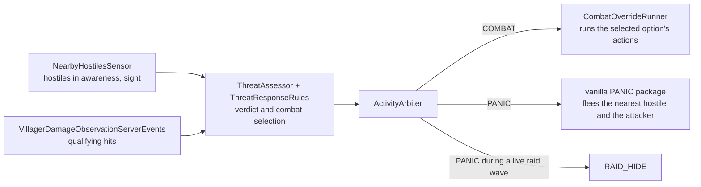

# Threat Response

How a villager notices hostiles and hits, decides whether to fight, flee or carry on, and carries that decision out.

The machinery the response rides on is shared with the rest of villager life and documented in
[`behavior_orchestration.md`](behavior_orchestration.md): where the assessment sits in the villager's AI step, how
`ActivityArbiter` turns a verdict into an activity, and how the override lane installs, preempts and stops runners.
This document owns everything threat-specific on top of it.

---

## Overview

Each assessment produces a `ThreatVerdict` — **COMBAT**, **PANIC** or **HOLD** — and, for COMBAT, a
`CombatSelection`: the option the villager fights with and its target. The verdict decides the activity; the activity
gates the day plan and the override lane, so one judgment of danger decides everything the villager does about it.

**Files:**

- `application/ai/sensors/NearbyHostilesSensor.java` and `bootstrap/event/VillagerDamageObservationServerEvents.java`
  — the evidence.
- `application/ai/threat/` — `ThreatAssessor` (reads the world, records the result), `ThreatAssessmentState` (one
  villager's evidence and assessment history, reached through `IVillagerBrain.threats()`), and the combat option
  contract.
- `domain/ai/threat/` — `ThreatResponseRules`, which decides over plain scalars carried by `ThreatSituation`, and the
  hit, decision and verdict types.
- `application/ai/override/CombatOverridePolicy.java` and `CombatOverrideRunner.java` — combat execution.

Everything here is transient. Nothing is saved with the villager, so after a load it holds until its first assessment
decides from scratch.

---

## Evidence

### Hostiles in awareness

`NearbyHostilesSensor` (a mod-native sensor; see
[`behavior_system.md`](behavior_system.md#sensors-the-read-side)) finds the live members of the
`settlements:villager_enemies` entity tag within the villager's awareness radius, nearest first, and writes four
memories:

| Memory | Holds |
|---|---|
| `NEARBY_HOSTILES` | Every hostile in awareness |
| `SIGHTED_HOSTILES` | Those of the nearest few that are in sight |
| `UNSEEN_HOSTILES` | Those of the nearest few that are out of sight |
| `NEAREST_HOSTILE` (vanilla) | The nearest hostile in awareness, seen or not |

Sight is checked only for the nearest few, under the sensor's own budget; a hostile past it is in neither sight list and
counts as *unchecked*. Awareness is the villager's own reach and says nothing about how dangerous a hostile is; that
is the threat weight, below. Its reach is capped by the vanilla living-entity scan the sensor reads; the sensor's TODO
records the replacement.

`NEAREST_HOSTILE` exists for vanilla's flee. A villager can panic at anything in awareness, so the flee target has to
come from the same awareness rather than from vanilla's own, shorter hostile sensor, which the villager does not run.

### Hits

`VillagerDamageObservationServerEvents` observes `LivingDamageEvent.Post` on the server. A hit **qualifies** unless its
damage type is in `settlements:does_not_alarm_villagers` (a cucco's peck), the villager hurt itself, there is no living
attacker (a fall, fire), or it cost no health. A qualifying hit:

- is recorded on the villager's threat state as a `QualifyingHit`, replacing any earlier one. Hits are judged one at a
  time and never summed, so a run of small hits never reads as one large one;
- makes an assessment due at once rather than at the next cadence;
- names its attacker in vanilla's `HURT_BY_ENTITY` memory, expiring with the hit, so the flee only ever runs from an
  attacker whose hit counted. Nothing erases that memory when the attacker dies, so a villager may flee a dead
  attacker's last position until the hit lapses.

Damage that does not qualify neither alarms the villager nor steers its escape.

---

## The assessment

### When it runs

`ThreatAssessor.tick` runs every villager tick from `VillagerBrain.preVanillaAiStep()`, ahead of `ActivityArbiter`, so
the activity answers the verdict made that tick. It assesses only when due: on a staggered cadence, when a hit was
recorded, or when the sensed hostiles changed. A trigger other than the cadence restarts the cadence, so a villager with
hostiles near does not also assess on the cadence's original phase.

With no hostile in awareness, no live hit and no response under way, the rules can only hold, so the assessor records
HOLD without scoring. That shortcut is the whole cost of the response for a peaceful villager.

### Three judgments

The assessor reduces the world to a `ThreatSituation` of scalars; `ThreatResponseRules` decides from that alone. The
application owns every world read and every entity reference; the domain owns the thresholds and their order.

- **Danger** decides whether the villager must respond at all. Each aware hostile contributes its threat weight,
  falling off linearly with distance to nothing at danger's own reach. That reach is independent of the awareness
  radius, so widening awareness does not make villagers more fearful.
- **Nerve** decides fight or flee: the villager's WIL gene, its health fraction and the option's own contribution,
  against the summed threat weight of every aware hostile. Distance stays out of nerve, so a fighter closing on its
  target does not rout itself by approaching.
- **Engagement** decides whether fighting is possible at all. Entering a fight needs a sighted hostile that a
  registered `CombatOption` can engage within its reach. Continuing one needs the option still able to fight, a hostile
  still in awareness or a live hit, and an engageable target within the targetless limit.

**Threat weight** is per entity type, from the `settlements:threat_weights` data map. A tagged enemy with no entry
takes `ThreatAssessor`'s default weight; a weight of zero leaves a hostile aware but harmless, and the codec rejects a
negative one.

**Unseen hostiles weigh less.** A hostile known to be out of sight carries only a fraction of its weight, in danger and
nerve alike (`ThreatAssessor.UNSEEN_THREAT_FRACTION`): a villager cannot fear what it cannot see, and the remainder
stands for what it hears. An unchecked hostile counts in full, so a large visible group is never discounted as hidden.

**A zombie villager being cured is never a target**, for any option: the patient is a villager in the making. It still
counts toward danger and nerve, since vanilla villagers flee one too.

**Babies never fight.** A baby has no override lane to run a fight in, so the assessor never offers it an option; it
panics or holds.

### The rules

`ThreatResponseRules.decide` is the authority on the order. The orderings that carry weight, and why:

- **Continuing a fight is judged before entering one.** The previous option keeps fighting at a lower nerve bar than
  entry, so a committed fighter is not sent running by a small loss of confidence, and an available alternative never
  displaces a fight that should have continued. Only a villager whose previous verdict was COMBAT can continue; a
  routed villager re-enters through the entry bar.
- **Fighting is judged before fleeing.** A capable fighter engages a sighted hostile whether or not the area is
  dangerous, and healing can lift a panicked villager back into the fight.
- **Panic** answers danger at or above its threshold, or a live hit.
- **A panic lingers** after it stops being alarming, for a short spell while a hostile remains in awareness (below).
- Otherwise the villager **holds**, and HOLD clears the selection.

### Hysteresis

Two bands, each keyed only on the previous verdict:

| Judgment | From COMBAT | From PANIC | From HOLD or none |
|---|---|---|---|
| Nerve | continue at the lower bar | enter at the higher bar | enter at the higher bar |
| Danger | calm threshold | calm threshold | alarm threshold |

The entry bar sits above the continue bar and the alarm threshold above the calm one; those orderings are what stop a
hostile loitering at a threshold from flipping the verdict. Two clocks cover what a band cannot:

- **The targetless limit** (`ThreatResponseRules.TARGETLESS_COMBAT_LIMIT`) ends a fight that has gone too long without
  an engageable target, live hit or not. Momentary loss of sight therefore does not end a fight, but a hostile the
  fighter can never engage — one in a cave below, a drowned underwater, a patient — cannot hold it in COMBAT. The clock
  runs on an *engageable* target rather than on a sighting, because the fighter never moves to reach one: a hostile it
  sees but cannot hit stalls it just the same. Under a live hit the fight then falls through to PANIC, so a villager
  shot by an attacker it cannot engage flees instead of standing.
- **The panic linger** (`ThreatResponseRules.PANIC_LINGER`) keeps a panicked villager panicking for a spell after its
  last alarming assessment while a hostile stays in awareness. A chaser defeats the danger band on its own: it re-closes
  the gap between the calm and alarm distances within seconds, so without the linger a chased villager would stop the
  moment it crossed the calm distance and flip between PANIC and HOLD for the length of the chase. Only an alarming
  assessment restarts the clock (`ThreatDecision.PANIC`, never `LINGER_IN_PANIC`), so a lingering panic cannot sustain
  itself, a hostile closing in fires the alarm again, and with nothing left in awareness the villager calms at once.
  The linger only ever turns a HOLD into PANIC.

Beyond those, the previous verdict and selection are the only history; there is no episode flag.

### The selection

Only COMBAT carries a `CombatSelection`. Its target is found afresh by each assessment and never carried over, so a
fighter that kills its target while a second hostile waits behind a wall fights on targetless, toward the targetless
limit, rather than chasing a dead entity's id.

`CombatOptionCatalog` holds every option in declared order, lowest first; entry takes the first that can engage, so a
stronger option should declare a lower order than a weaker one.

---

## Responding

### From verdict to activity

`ActivityArbiter` turns the verdict into an activity: COMBAT to `COMBAT` ahead of every raid row, PANIC to `RAID_HIDE`
during a live raid wave and to `PANIC` otherwise. The full precedence, and why the arbiter erases movement and
interaction targets on entering PANIC or COMBAT, are in
[`behavior_orchestration.md`](behavior_orchestration.md#activity-arbitration). The assessment has no raid input: where
a frightened villager goes during a raid is the arbiter's decision, not the verdict's.

Either response suspends the day plan, and the interrupted slot is retried once the plan resumes, unless its window
has closed by then.

### Panic

PANIC runs vanilla's flee from `VanillaBehaviorPackages.getPanicPackage`, fed by this response rather than by vanilla's
sensors: it runs from `NEAREST_HOSTILE` and from the `HURT_BY_ENTITY` of a live qualifying hit. The package leaves out
vanilla's own panic trigger and calm-down; the arbiter enters and leaves PANIC with the verdict.

TODO: panicking villagers summon no iron golems; vanilla summons them from its panic trigger, which the package leaves
out, and the summon needs to become a behavior of its own.

### Combat

The assessment decides *whether* and *with what* a villager fights; the override lane carries it out. While the verdict
is COMBAT, `CombatOverridePolicy` (`EMERGENCY`, admitted only during `COMBAT`) requests a fresh
`CombatOverrideRunner`. The runner reads the villager's selection every tick and ends on the tick the verdict leaves
COMBAT, so entry waits for the next policy evaluation while withdrawal waits for nothing.

- **One action at a time.** An action is an ordinary `IBehavior` that the selected option creates aimed at the target.
  The runner keeps a running action while the selection's option is unchanged, and stops a finished, superseded or
  overrunning action completely before launching the next, so two actions never hold the villager at once and a
  replaced action has released its navigation, held items and animation.
- **Ownership is held between actions.** The runner stays installed, and with it `PLAN_BEHAVIOR_ACTIVE`, so neither the
  day plan nor a trade slips in for a tick between two attacks.
- **Time is bounded per action.** Each action has its own ceiling, reset on replacement; the fight as a whole has none
  and lasts exactly as long as the verdict.
- **No action, no target in reach.** The runner only turns the villager to face the nearest aware hostile. Nothing
  moves it: `COMBAT`'s activity package is empty.
- **Villagers keep talking.** The runner claims `MOVEMENT` and `INTERACTION` only, so social cues on other channels
  still fire mid-fight, and the `COMBAT` activity has a dialogue occasion of its own.
- An action that throws ends the runner; the policy installs a fresh one at its next evaluation while the verdict
  holds. Removal, unload and a brain refresh stop it through the lane's `forceStop`.

Combat options are registered in `di/modules/server/CombatOptionModule.java`, the authority on membership. Their
actions belong to no behavior catalog entry and no day-plan pool.

---

## Extending

These seams are the contract; each owning file is the authority on what is in it today. The first four are datapack
data, so a modpack extends them without code.

| To | Change |
|---|---|
| Make a mob a villager enemy | The `settlements:villager_enemies` entity type tag |
| Make it more or less dangerous | Its entry in the `settlements:threat_weights` data map; zero makes it harmless |
| Keep a damage type from alarming villagers | The `settlements:does_not_alarm_villagers` damage type tag |
| Let combat projectiles pass a friendly mob | The `settlements:villager_allies` entity type tag |
| Give villagers a new way to fight | A combat option, below |

### Adding a combat option

1. Implement `CombatOption`: an `order()` unique among options (`CombatOptionCatalog` rejects a collision at
   construction), its reach and nerve contribution, read-only `canEngage` / `canContinue` checks that never build a
   behavior, start a cooldown or acquire anything, and `createBehavior(target)` returning a fresh, unstarted action.
   `EggCombatOption` is the reference.
2. Write the action as an ordinary `IBehavior` whose stop releases everything it took — navigation, held items,
   animation — since the combat runner may replace it at any tick. Keep it out of the behavior catalog and every pool.
3. Bind the option `@Binds @IntoSet` in `CombatOptionModule`.

An option that must acquire something when its action starts, such as a shared weapon, has no way yet to report a
failed acquisition back to the assessment; the TODO in `CombatOverrideRunner.launchAction` records the gap.

---

## Explicit Design Decisions

| Decision | Choice | Rationale |
|---|---|---|
| One assessment decides every response | A single verdict per villager, read by the activity arbiter | Separate panic and combat triggers disagree about the same danger; one judgment, applied in a fixed order, cannot. |
| Verdict and activity are separate decisions | `ThreatAssessor` decides the verdict, `ActivityArbiter` the activity | Raids, bells and the day plan also compete for the activity. Keeping them out of the assessment leaves it one question — how threatened is this villager — and gives the activity one owner. |
| The rules see only scalars | `ThreatSituation` in, `ThreatDecision` out | World reads and entity identity stay in the application and the domain holds only the thresholds and their order, so no mirror of the world has to be kept in step with it. |
| Distance is in danger, not in nerve | Danger falls off with distance; nerve weighs only how many and how strong | Whether to respond depends on how close the hostiles are; whether to fight depends on the odds, which closing in does not change. |
| Sight gates entry, not continuation | Continuation needs awareness or a live hit, within the targetless limit | A fighter should not drop its fight the instant its target steps behind a wall, nor start one against a hostile it cannot see. |
| A fight without an engageable target ends | The targetless limit, even under a live hit | With awareness alone, a hostile the villager can never reach holds it in COMBAT indefinitely, and COMBAT outranks even sleep. |
| A panic lingers only from PANIC, while a hostile is aware | Rule order: after the alarm, before HOLD | A wider calm band only lengthens each cycle against a chaser; treating a hostile that targets the villager as alarming pins PANIC behind a fence-stuck chaser with no limit of its own. |
| Hits are judged one at a time | The latest qualifying hit replaces the last | Summing hits makes a run of small ones look like one large one. A damage-type tag, not a damage threshold, exempts harmless sources such as a cucco's peck, because a threshold would also ignore a real attacker's small hit. |
| Enemies, weights and exemptions are data | Entity and damage type tags, and a data map | Modpacks add mobs; each new hostile should need a datapack entry, not code. |
| A fight is one override, not one per action | `CombatOverrideRunner` holds the villager across successive actions | Releasing the villager between actions would let the day plan or a trade take it for a tick mid-fight, and a same-tier override never replaces a running one, so per-action overrides would need preemption rules of their own. |
| Combat actions stay out of the catalog and pools | Each `CombatOption` creates its own action | A day plan must never schedule an emergency-only action, and an option's availability checks run on every assessment, so they must be read-only, which building and validating a catalog behavior is not. |
| Combat eggs only hinder | Slowness and knockback, no damage | A nitwit cannot tell a raider from a farm zombie, so a volley that cannot kill keeps a misdirected one harmless. |
